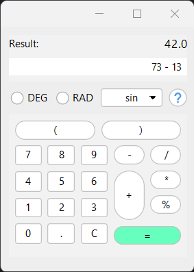
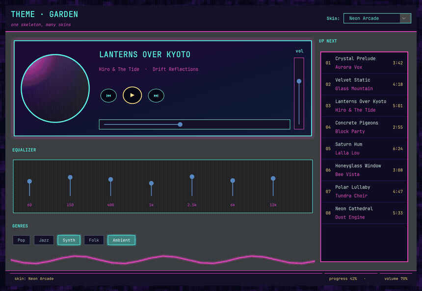

# 🌳 SwingTree [](https://opensource.org/licenses/MIT)  #
## Modern Declarative UI Design for Swing ##

**SwingTree lets you build Swing UIs the way you *think* about them** —
as a tree of nested components, declared fluently, without the boilerplate.

Think [Jetpack Compose](https://developer.android.com/jetpack/compose),
[SwiftUI](https://developer.apple.com/xcode/swiftui/) or [Flutter](https://flutter.dev),
but for plain old Swing
(and close in spirit to [JetBrains' UI DSL](https://plugins.jetbrains.com/docs/intellij/kotlin-ui-dsl-version-2.html#ui-dsl-basics)).
No new runtime, no rewrite — it sits right on top of the Swing you already know.

<table>
<tr>
<th style="background-color: rgba(0,0,0,10%);">
</th>
<th style="background-color: rgba(0,0,0,10%);">
</th>
</tr>
<tr>
<td> 

- 🪶 lightweight, HTML-like GUI code that reads like the UI it builds
- 📐 powerful layout declaration powered by `MigLayout`
- 🤝 plays nicely with custom components and legacy Swing code
- 🔍 a functional, lambda-friendly API for peeking into the UI tree and manipulating components freely
- ⚡ concise event handling through `onClick`, `onChange` and friends
- 🎨 advanced styling through a CSS-like DSL API

</td>
<td>
	

</td>
</tr>
<tr>
<td> 

- 🎞️ [animated styling](docs/markdown/An-Advanced-Style-Animation.md)
- 🧩 built-in [property support](https://github.com/globaltcad/sprouts) 
  for [MVVM](docs/markdown/Advanced-MVVM.md) and [MVI](docs/markdown/Functional-MVVM.md) architecture
  (so your UI and business logic stay decoupled)
- 🛡️ user-friendly, [stability-oriented error handling](docs/markdown/Sane-Error-Handling.md)
- 📦 support for [Data-Oriented Programming](docs/markdown/Data-Oriented-SwingTree.md)
- ✅ tried, tested and used extensively in production

</td>
<td>

- 💡 [Motivation](docs/markdown/Motivation.md)
- 🚀 [Getting Started](docs/markdown/Climbing-Swing-Tree.md)
- 📚 [The Wiki](docs/markdown/README.md)
- 📖 [Living Documentation](https://globaltcad.github.io/swing-tree/)
- 🤖 [AI Agent Skill file](docs/agent-skills/SKILL.md)

</td>
</tr>
</table>


---

## ✨ A Quick Taste ##

Here's a simple calculator UI built with SwingTree on top of the `FlatLaF` look-and-feel:



```java
FlatLightLaf.setup();
UI.of(this/*JPanel subtype*/).withLayout("fill, insets 10")
.add("grow, span, wrap",
   UI.panel("fill, ins 0")
   .add("shrink", UI.label("Result:"))
   .add("grow, wrap",
      UI.label("42.0", UI.HorizontalAlignment.RIGHT)
      .withProperty("FlatLaf.styleClass", "large")
   )
   .add("grow, span, wrap", UI.textField(HorizontalAlignment.RIGHT, "73 - 31"))
)
.add("growx", UI.radioButton("DEG"), UI.radioButton("RAD"))
.add("shrinkx", UI.splitButton("sin"))
.add("growx, wrap", UI.button("Help").withProperty("JButton.buttonType", "help"))
.add("growx, span, wrap",
   UI.panel("fill")
   .add("span, grow, wrap",
       UI.panel("fill, ins 0")
       .add("grow",
           UI.button("(").withProperty("JButton.buttonType", "roundRect"),
           UI.button(")").withProperty("JButton.buttonType", "roundRect")
       )
   )
   .add("grow",
      UI.panel("fill, ins 0, wrap 3")
      .apply( it -> {
         String[] labels = {"7","8","9","4","5","6","1","2","3","0",".","C"};
         for ( var l : labels ) it.add("grow", UI.button(l));
      }),
      UI.panel("fill, ins 0")
      .add("grow", UI.button("-").withProperty("JButton.buttonType", "roundRect"))
      .add("grow, wrap", UI.button("/").withProperty("JButton.buttonType", "roundRect"))
      .add("span, grow, wrap",
         UI.panel("fill, ins 0")
         .add("grow", 
            UI.button("+").withProperty("JButton.buttonType", "roundRect"),
            UI.panel("fill, ins 0")
            .add("grow, wrap",
               UI.button("*").withProperty("JButton.buttonType", "roundRect"),
               UI.button("%").withProperty("JButton.buttonType", "roundRect")
            )
         ),
         UI.button("=")
         .withBackground(new Color(103, 255, 190))
         .withProperty("JButton.buttonType", "roundRect")
      )
   )
);
```

Notice how the **code mirrors the shape of the UI**. A few things worth pointing out:

- 🎯 **One import to rule them all.** Everything lives on the `UI` class, which you
  can import statically to drop the `UI.` prefixes entirely.
- 🧱 **Builders take two kinds of arguments:** a `String` of layout constraints,
  followed by the UI nodes it applies to.
- 📐 Those constraints go straight to the layout manager — by default a
  `MigLayout` instance, the most versatile general-purpose layout manager
  (though you're free to swap in any other layout manager you like).

Hungry for more? Browse the <a href="src/test/java/examples">examples folder</a> inside the test suite.

---

## 🌷 One Skeleton, Many Skins ##

SwingTree's styling API isn't just paint on top — it's expressive enough to make
the *same* component tree look like completely different applications.
Here is the [**Theme Garden**](src/test/java/examples/zen/ThemeGardenView.java) example, swapping live between hand-crafted themes
without touching a single line of layout code:

<p align="center">
  
</p>

Every skin you see is pure SwingTree styling — colors, gradients, rounded corners,
shadows and animations — applied declaratively over one shared UI definition.
The mechanic that makes this work — central style sheets plus semantic
`group(..)` tags on components — is explained in the
[Style Sheets and Groups](docs/markdown/Style-Sheets-And-Groups.md) guide.

---

## 🤖 Building with an AI coding agent? ##

If you let an AI assistant write SwingTree code for you, 
drop **[`docs/agent-skills/SKILL.md`](docs/agent-skills/SKILL.md)** into
its context first. It is a single, self-contained file that gives the agent deep
intuition for the whole library: the builder API, MigLayout and reactive layouts,
the Sprouts property/lens system, MVI/MVL and MVVM view models, the styling and
animation APIs, plus the non-obvious gotchas — so it writes idiomatic SwingTree
instead of guessing.

---

## 📥 Getting started with Apache Maven ##

```xml
<dependency>
  <groupId>io.github.globaltcad</groupId>
  <artifactId>swing-tree</artifactId>
  <version>0.23.0</version>
</dependency>
```

---

## 📥 Getting started with Gradle ##
Groovy DSL:
```groovy
implementation 'io.github.globaltcad:swing-tree:0.23.0'
```
Kotlin DSL:
```kotlin
implementation("io.github.globaltcad:swing-tree:0.23.0")
```
---

## 📥 Getting started with [](https://jitpack.io/#globaltcad/swing-tree) ##
**1. Add the JitPack url in your root `build.gradle` at the end of `repositories`**
```groovy
allprojects {
	repositories {
		//...
		maven { url 'https://jitpack.io' }
	}
}
```
**2. Add swing-tree as dependency**

...either by specifying the version tag:
```groovy
dependencies {
	implementation 'com.github.globaltcad:swing-tree:0.23.0'
}
```
...or by using a custom commit hash instead:
```groovy
dependencies {
	implementation 'com.github.globaltcad:swing-tree:02cbc6dc'//Any commit hash...
}
```
---