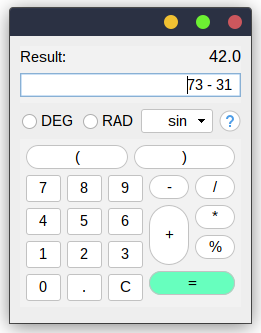

# SwingTree [](https://opensource.org/licenses/MIT)  #
## Modern Declarative UI Design for Swing ##

SwingTree is a Swing based UI framework for creating boilerplate free 
and composition based Swing UIs fluently. <br>
Think [Jetpack Compose](https://developer.android.com/jetpack/compose), [SwiftUI](https://developer.apple.com/xcode/swiftui/) or [Flutter](https://flutter.dev) but for Swing 
(similar to [JetBrain's UI DSL](https://plugins.jetbrains.com/docs/intellij/kotlin-ui-dsl-version-2.html#ui-dsl-basics)).

- [Motivation](docs/markdown/Motivation.md)
- [Getting Started](docs/markdown/Climbing-Swing-Tree.md)
- [Living Documentation](https://globaltcad.github.io/swing-tree/)

<table>
<tr>
<th></th>
<th></th>
</tr>
<tr>
<td> 

- lightweight and intuitive HTML like GUI code  
- advanced styling through a CSS like DSL API
- powerful layout declaration based on `MigLayout`
- a functional lambda friendly API for peeking into the underlying UI tree and manipulating swing components freely
- concise event registration through `onClick`, `onChange` methods...
- compatible with custom swing components and legacy Swing code
- built-in [MVVM property](https://github.com/globaltcad/sprouts) support for dynamic [UI design decoupled from business logic](docs/markdown/Advanced-MVVM.md) 
- user friendly [stability oriented error handling](docs/markdown/Sane-Error-Handling.md)
- tried, tested and used extensively in production

</td>
<td>
	

</td>
</tr>
</table>


---

Here an example of a simple calculator UI based on the `FlatLaF` look-and-feel:



This was made using the following code:

```java
FlatLightLaf.setup();
UI.of(this/*JPanel subtype*/).withLayout("fill, insets 10")
.add("grow, span, wrap",
   UI.panel("fill, ins 0")
   .add("shrink", UI.label("Result:"))
   .add("grow, wrap",
      UI.label("42.0", UI.HorizontalAlignment.RIGHT)
      .withProperty("FlatLaf.styleClass", "large")
   )
   .add("grow, span, wrap", UI.textField(HorizontalAlignment.RIGHT, "73 - 31"))
)
.add("growx", UI.radioButton("DEG"), UI.radioButton("RAD"))
.add("shrinkx", UI.splitButton("sin"))
.add("growx, wrap", UI.button("Help").withProperty("JButton.buttonType", "help"))
.add("growx, span, wrap",
   UI.panel("fill")
   .add("span, grow, wrap",
       UI.panel("fill, ins 0")
       .add("grow",
           UI.button("(").withProperty("JButton.buttonType", "roundRect"),
           UI.button(")").withProperty("JButton.buttonType", "roundRect")
       )
   )
   .add("grow",
      UI.panel("fill, ins 0, wrap 3")
      .apply( it -> {
         String[] labels = {"7","8","9","4","5","6","1","2","3","0",".","C"};
         for ( var l : labels ) it.add("grow", UI.button(l));
      }),
      UI.panel("fill, ins 0")
      .add("grow", UI.button("-").withProperty("JButton.buttonType", "roundRect"))
      .add("grow, wrap", UI.button("/").withProperty("JButton.buttonType", "roundRect"))
      .add("span, grow, wrap",
         UI.panel("fill, ins 0")
         .add("grow", 
            UI.button("+").withProperty("JButton.buttonType", "roundRect"),
            UI.panel("fill, ins 0")
            .add("grow, wrap",
               UI.button("*").withProperty("JButton.buttonType", "roundRect"),
               UI.button("%").withProperty("JButton.buttonType", "roundRect")
            )
         ),
         UI.button("=")
         .withBackground(new Color(103, 255, 190))
         .withProperty("JButton.buttonType", "roundRect")
      )
   )
);
```

As you can see, swing tree has a very simple API, which only requires a
single class to be imported, the `UI` class which can even be imported
statically to remove any `UI.` prefixes.

Also, note that there are usually 2 arguments
added to a tree node: a `String` and then UI nodes.
This first argument simply translates
to the layout constraints which should be applied
to the UI element(s) added.

In this example, strings will be passed to a `MigLayout`
simply because it is a general purpose layout and no other
layout was specified.

For more examples take a look at the <a href="src/test/groovy/swingtree/examples">examples folder</a> inside the test suite.

---

SwingTree is not merely a GUI builder/layout library, it also provides a powerful
styling API which allows you to create stunningly yet highly dynamic UI styles.
The following example demonstrates both styling and animation capabilities of SwingTree:


This was made using the following code:

```java
import swingtree.UI;
import static swingtree.UI.*;

public final class TransitionalAnimation extends Panel
{
    private static final double THICKNESS = 5;
    private final Var<Boolean> isOn = Var.of(false);
    private final Var<Double>  progress = Var.of(0.0);

    public TransitionalAnimation() {
        UI.of(this).withLayout(WRAP(1), "[grow]", "[grow]")
        .add(CENTER,
            html("<h1 style=\"text-align: center;\">A Style Animation</h1>" +
                    "<p>...transitioning between 2 states...</p>")
        )
        .add(GROW,
            panel(FILL.and(WRAP(1))).withStyle(it->it.borderRadius(32).backgroundColor(Color.LIGHT_GRAY))
            .add(CENTER,
                box().add(
                    label("Toggle the switch to see the animation!")
                    .withTransitionalStyle(this.isOn, LifeTime.of(2, TimeUnit.SECONDS), (state,it) -> it
                        .padding(26 - (THICKNESS/2) * this.progress.set(state.progress()).get())
                        .margin(42 - (THICKNESS/2) * state.progress())
                        .borderRadius( 38 * state.progress() )
                        .border(THICKNESS * state.progress(), color(0.5,1,1))
                        .backgroundColor(200/255d, 210/255d, 220/255d, state.progress() )
                        .shadow("bright", s -> s
                            .color(0.5, 1, 1, state.progress())
                            .offset(-6)
                        )
                        .shadow("dark", s -> s
                            .color(0, 0, 0, state.progress()/4)
                            .offset(+6)
                        )
                        .shadowBlurRadius(10 * state.progress())
                        .shadowSpreadRadius(-5 * state.progress())
                        .shadowIsInset(false)
                        .gradient(Layer.BORDER, "border-grad", grad -> grad
                            .span(Span.TOP_LEFT_TO_BOTTOM_RIGHT)
                            .clipTo(ComponentArea.BORDER)
                            .colors(
                                color(0.75, 1, 0.5, state.progress()),
                                color(0.5, 1, 1, 0)
                            )
                        )
                        .gradient(Layer.BACKGROUND, "content-grad", grad -> grad
                            .type(GradientType.RADIAL)
                            .boundary(ComponentBoundary.BORDER_TO_INTERIOR)
                            .clipTo(ComponentArea.BODY)
                            .size(100+250*state.progress())
                            .offset(
                                it.component().getWidth()*state.progress(),
                                it.component().getHeight()*state.progress()
                            )
                            .colors(
                                color(0.75, 1, 0.5, state.progress()),
                                color(0.5, 1, 1, 0)
                            )
                        )
                    )
                )
            )
            .add(CENTER,
                toggleButton("toggle me").onClick( it -> isOn.set(it.get().isSelected()) )
            )
        )
        .add(GROW_X, progressBar(Align.HORIZONTAL, this.progress));
    }
    public static void main(String[] args) {
        UI.show( f -> new TransitionalAnimation() );
    }
}
```

---
## Getting started with Apache Maven ##

```
<dependency>
  <groupId>io.github.globaltcad</groupId>
  <artifactId>swing-tree</artifactId>
  <version>0.11.0</version>
</dependency>
```

---

## Getting started with Gradle ##
Groovy DSL:
```
implementation 'io.github.globaltcad:swing-tree:0.11.0'
```
Kotlin DSL:
```
implementation("io.github.globaltcad:swing-tree:0.11.0")
```
---

## Getting started with [](https://jitpack.io/#globaltcad/swing-tree) ##
**1. Add the JitPack url in your root `build.gradle` at the end of `repositories`**
```
allprojects {
	repositories {
		//...
		maven { url 'https://jitpack.io' }
	}
}
```
**2. Add swing-tree as dependency**

...either by specifiying the version tag:
```
dependencies {
	implementation 'com.github.globaltcad:swing-tree:v0.11.0'
}
```
...or by using a custom commit hash instead:
```
dependencies {
	implementation 'com.github.globaltcad:swing-tree:68f56d3'//Any commit hash...
}
```
---

