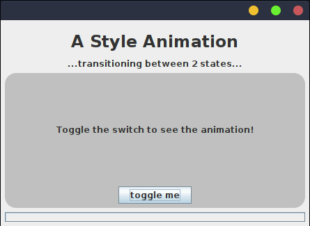

# An Advanced Style Animation #

> **Prerequisites:** This guide assumes you understand
> [Climbing the Swing Tree → Blooming Flowers](./Climbing-Swing-Tree.md#blooming-flowers)
> (per-component `withStyle(..)`) and
> [Climbing the Swing Tree → Harvesting Fruit](./Climbing-Swing-Tree.md#harvesting-fruit)
> (basic animations with `animateFor(..)`).

SwingTree is not merely a GUI builder/layout library, it also provides a powerful
styling API which allows you to create stunningly yet highly dynamic UI styles.



This example GUI, demonstrates both styling and animation capabilities of SwingTree:.
It was made using the following code:

```java
import swingtree.UI;
import static swingtree.UI.*;

public final class TransitionalAnimation extends Panel
{
    private static final double THICKNESS = 5;
    private final Var<Boolean> isOn = Var.of(false);
    private final Var<Double>  progress = Var.of(0.0);

    public TransitionalAnimation() {
        UI.of(this).withLayout(WRAP(1), "[grow]", "[grow]")
        .add(CENTER,
            html("<h1 style=\"text-align: center;\">A Style Animation</h1>" +
                    "<p>...transitioning between 2 states...</p>")
        )
        .add(GROW,
            panel(FILL.and(WRAP(1))).withStyle(it->it.borderRadius(32).backgroundColor(Color.LIGHT_GRAY))
            .add(CENTER,
                box().add(
                    label("Toggle the switch to see the animation!")
                    .withTransitionalStyle(this.isOn, LifeTime.of(2, TimeUnit.SECONDS), (state,it) -> it
                        .padding(26 - (THICKNESS/2) * this.progress.set(state.progress()).get())
                        .margin(42 - (THICKNESS/2) * state.progress())
                        .borderRadius( 38 * state.progress() )
                        .border(THICKNESS * state.progress(), color(0.5,1,1))
                        .backgroundColor(200/255d, 210/255d, 220/255d, state.progress() )
                        .shadow("bright", s -> s
                            .color(0.5, 1, 1, state.progress())
                            .offset(-6)
                        )
                        .shadow("dark", s -> s
                            .color(0, 0, 0, state.progress()/4)
                            .offset(+6)
                        )
                        .shadowBlurRadius(10 * state.progress())
                        .shadowSpreadRadius(-5 * state.progress())
                        .shadowIsInset(false)
                        .gradient(Layer.BORDER, "border-grad", grad -> grad
                            .span(Span.TOP_LEFT_TO_BOTTOM_RIGHT)
                            .clipTo(ComponentArea.BORDER)
                            .colors(
                                color(0.75, 1, 0.5, state.progress()),
                                color(0.5, 1, 1, 0)
                            )
                        )
                        .gradient(Layer.BACKGROUND, "content-grad", grad -> grad
                            .type(GradientType.RADIAL)
                            .boundary(ComponentBoundary.BORDER_TO_INTERIOR)
                            .clipTo(ComponentArea.BODY)
                            .size(100+250*state.progress())
                            .offset(
                                it.component().getWidth()*state.progress(),
                                it.component().getHeight()*state.progress()
                            )
                            .colors(
                                color(0.75, 1, 0.5, state.progress()),
                                color(0.5, 1, 1, 0)
                            )
                        )
                    )
                )
            )
            .add(CENTER,
                toggleButton("toggle me").onClick( it -> isOn.set(it.get().isSelected()) )
            )
        )
        .add(GROW_X, progressBar(Align.HORIZONTAL, this.progress));
    }
    public static void main(String[] args) {
        UI.show( f -> new TransitionalAnimation() );
    }
}
```

---

## How `withTransitionalStyle` works ##

The trick this example pivots on is `withTransitionalStyle(Var<Boolean>, LifeTime, BiFunction)`.
Given a *boolean* property and a duration, SwingTree continuously interpolates
a `progress` value between `0` (matching `false`) and `1` (matching `true`)
over the configured `LifeTime` every time the property flips.

Inside the lambda you receive that `state` plus a `ComponentStyleDelegate`
(the familiar `it`), so you can *multiply* any style property by
`state.progress()` — radii, padding, opacity, shadow blur, gradient size,
offset, you name it. The result is that a single boolean toggle smoothly
animates *every* configured property between the two extremes.

This is purely view-side animation. If you want the animation state to live
inside your view model — for testing, persistence, or coordinating multiple
animations — see [Modelling Animations](./Modelling-Animations.md).

## Where to next? ##

- [Modelling Animations](./Modelling-Animations.md) — the MVI-friendly
  alternative that puts animation state into the view model and uses
  `UI.animate(vm, vm::someAnimation)` plus `withRepaintOn(..)`.
- [Style Sheets and Groups](./Style-Sheets-And-Groups.md) — to share
  styled animations across many components.
- [Font Styling](./Font-Styling.md) and
  [Background Filtering](./Background-Filtering.md) — sibling deep-dives
  on specific corners of the style API.