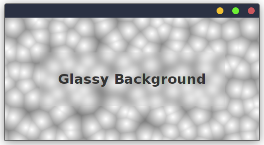
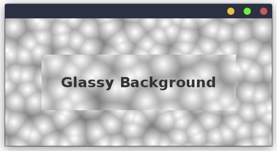

# Background Filtering #

If a particular component does not have an opaque background
color, image, gradient or procedural noise, 
then it will be **non-opaque**,
which means that the rendering of the parent component is passed through 
to the surface of the child component.

In such cases it is often desirable to apply some sort of
filtering based effect on top of the parents' appearance.

A classical example for this is a gaussian blur filter.
It produces a unique effect that makes a component
look like it is made out of glass.

SwingTree allows you to style your components with filter effects
through its style API.

Consider taking a look at the following example code:

```java
import swingtree.UI;

import static swingtree.UI.*;

public class GlassyBackground extends Panel
{
    public GlassyBackground() {
        UI.of(this).withLayout("fill")
        .withStyle( conf -> conf
            .prefSize(520,250)
            .noise( noiseConf -> noiseConf
                .colors(Color.GRAY, Color.WHITE)
                .function(NoiseType.TISSUE)
            )
        )
        .add("center",
            UI.label("Glassy Background")
            .withStyle( conf -> conf
                .fontSize(28)
                .padding(38)
                .backgroundColor(Color.TRANSPARENT)
                .parentFilter( filterConf -> filterConf
                    .area(ComponentArea.BODY)
                    .blur(16)
                )
            )
        );
    }

    public static void main(String[] args) {
        UI.show( f -> new GlassyBackground() );
    }
}
```

The above code creates a parent panel with a cell like procedural noise
texture on its surface. This style is defined in the first `withStyle` call.
Here we use procedural noise because it demonstrates the effect of the filter
more clearly.

The second `withStyle` is applied to a label component that is added to the panel.
Here we set the background color to `Color.TRANSPARENT` to ensure that the component
is non-opaque and then apply a blur filter to the passed through parent rendering
using the `parentFilter` sub-style.




As you can see, the label component now has a blurred appearance.
Although that does look nice, it is still not quite what we want.
Glass in the real world may not just be blurring what passes through it, 
it very often also magnifies the content behind it through refraction.

Additionally, to the blurring, SwingTree also allows you to apply a scaling 
factor to the filter configuration. It causes the background to be scaled
up or down before it is blurred.

Here is an example that demonstrates this:

```java
import swingtree.UI;

import static swingtree.UI.*;

public class ScaledGlassyBackground extends Panel
{
    public ScaledGlassyBackground() {
        UI.of(this).withLayout("fill")
        .withStyle( conf -> conf
            .prefSize(520,250)
            .noise( noiseConf -> noiseConf
                .colors(Color.GRAY, Color.WHITE)
                .function(NoiseType.TISSUE)
            )
        )
        .add("center",
            UI.label("Glassy Background")
            .withStyle( conf -> conf
                .fontSize(28)
                .padding(38)
                .backgroundColor(Color.TRANSPARENT)
                .parentFilter( filterConf -> filterConf
                    .area(ComponentArea.BODY)
                    .blur(6)
                    .scale(1.25, 1.25)
                )
            )
        );
    }

    public static void main(String[] args) {
        UI.show( f -> new ScaledGlassyBackground() );
    }
}
```

This is again very similar to the previous example, but this time
instead of just applying a blur filter, we also set the scale factor
to 1.25. This causes the background to be scaled up by 25% before it is blurred.
Also, not that we reduced the blur factor to 6. This is because the scaling
operation already causes the background to look more blurred.
So the blur factor needs to be reduced to compensate for that.



Now the effect looks really convincing. It gets even better when
resizing the window and seeing how the background scales dynamically.
That really make the component fell like glass.
