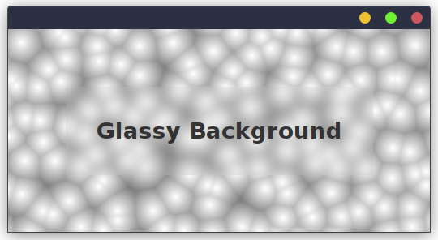
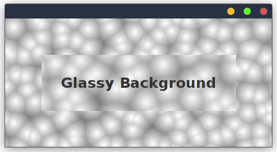

# Background Filtering #

> **Prerequisites:** This guide assumes you are comfortable with the
> per-component `withStyle(..)` API. If `withStyle` is new to you, start
> with [Climbing the Swing Tree → Blooming Flowers](./Climbing-Swing-Tree.md#blooming-flowers).
> Everything below also works inside a central
> [style sheet](./Style-Sheets-And-Groups.md).

If a particular component does not have an opaque background
color, image, gradient or procedural noise, 
then it will be **non-opaque**,
which means that the rendering of the parent component is passed through 
to the surface of the child component.

In such cases it is often desirable to apply some sort of
filtering based effect on top of the parents' appearance.

A classical example for this is a gaussian blur filter.
It produces a unique effect that makes a component
look like it is made out of glass.

SwingTree allows you to style your components with filter effects
through its style API.

Consider taking a look at the following example code:

```java
import swingtree.UI;

import static swingtree.UI.*;

public class GlassyBackground extends Panel
{
    public GlassyBackground() {
        UI.of(this).withLayout("fill")
        .withStyle( conf -> conf
            .prefSize(520,250)
            .noise( noiseConf -> noiseConf
                .colors(Color.GRAY, Color.WHITE)
                .function(NoiseType.TISSUE)
            )
        )
        .add("center",
            UI.label("Glassy Background")
            .withStyle( conf -> conf
                .fontSize(28)
                .padding(38)
                .backgroundColor(Color.TRANSPARENT)
                .parentFilter( filterConf -> filterConf
                    .area(ComponentArea.BODY)
                    .blur(16)
                )
            )
        );
    }

    public static void main(String[] args) {
        UI.show( f -> new GlassyBackground() );
    }
}
```

The above code creates a parent panel with a cell like procedural noise
texture on its surface. This style is defined in the first `withStyle` call.
Here we use procedural noise because it demonstrates the effect of the filter
more clearly.

The second `withStyle` is applied to a label component that is added to the panel.
Here we set the background color to `Color.TRANSPARENT` to ensure that the component
is non-opaque and then apply a blur filter to the passed through parent rendering
using the `parentFilter` sub-style. We set the radius of the blur filter kernel to 16
and clip the result to the body area of the component.




As you can see, the label component now has a blurred background.
Although that does look nice, it is still not quite what we want.
Not only does glass in the real world sometimes blur the light passing through it, 
it very often also magnifies it. This is due to the fact that the light is refracted
when passing through the glass.

So additionally to the blurring, SwingTree also allows you to apply a scaling 
factor to the filter configuration. It causes the background to be scaled
up or down before it is blurred and displayed on the component.

Here is an example that demonstrates this:

```java
import swingtree.UI;

import static swingtree.UI.*;

public class ScaledGlassyBackground extends Panel
{
    public ScaledGlassyBackground() {
        UI.of(this).withLayout("fill")
        .withStyle( conf -> conf
            .prefSize(520,250)
            .noise( noiseConf -> noiseConf
                .colors(Color.GRAY, Color.WHITE)
                .function(NoiseType.TISSUE)
            )
        )
        .add("center",
            UI.label("Glassy Background")
            .withStyle( conf -> conf
                .fontSize(28)
                .padding(38)
                .backgroundColor(Color.TRANSPARENT)
                .parentFilter( filterConf -> filterConf
                    .area(ComponentArea.BODY)
                    .blur(6)
                    .scale(1.25, 1.25)
                )
            )
        );
    }

    public static void main(String[] args) {
        UI.show( f -> new ScaledGlassyBackground() );
    }
}
```

This is again very similar to the previous example, but this time
instead of just applying a blur filter, we also set the scale factor
to `1.25`. This causes the background to be scaled up by `25%` before it is blurred.
Also, note that we reduced the blur factor to `6`. This is because the scaling
operation already causes the background to look a little bit blurry.
So the additional blur needs to be reduced to compensate for that.



Now the effect looks really convincing. It gets even better when
resizing the window and seeing how the background scales dynamically.
That really makes the component feel like glass.

## Where to next? ##

- The companion [Font Styling](./Font-Styling.md) guide covers gradient
  and noise paints applied to text.
- Want this style to apply automatically to every "card" component in your
  application? Lift it into a central
  [style sheet](./Style-Sheets-And-Groups.md) keyed on a `group(..)` tag.
- For a fancier showcase combining shadows, gradients, animation and a
  toggle, see [An Advanced Style Animation](./An-Advanced-Style-Animation.md).
