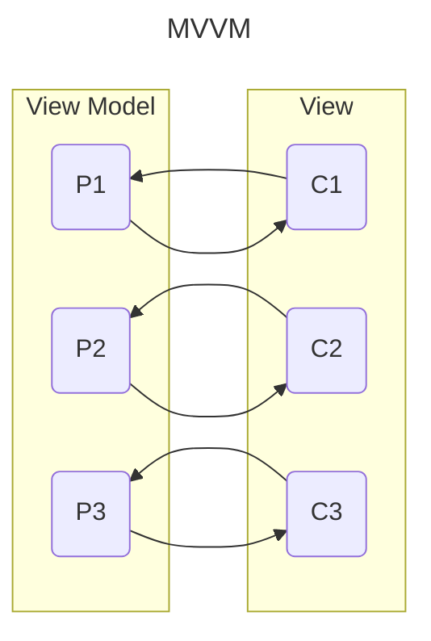

# MVVM using Sprouts #

If you know how to write GUI declarations in SwingTree you are not far away
from being able to write proper business logic for you UI without it
being dependent on it.

Because SwingTree is not just a library for declarative GUI design, it is
also a library for writing the necessary architectural patterns needed
for bringing your beautiful GUIs to life.

This is typically done through patterns often referred to as `MVVM`/`MVC` and `MVP`, which are
shortcuts basically meaning `Model`-`View`-`ViewModel/Controller/Presenter`. <br>
But in this little guide we focus on the tries and tested `MMVVM` pattern.
Keep in mind though, all of these fancy patterns exist with the same main goal of:

**Separating the UI from the business logic!**

In Swing-Tree you can achieve this separation by using the
**Sprouts property collection API**, which introduces an implementations
of the concept of a so called "property".

Properties are a simple yet powerful concept, they are wrapper types
for the field variables of your view models which allow your UI to register change listeners on them.
These listeners thereby make it possible to dynamically update UI components
when your business logic mutates the properties, and also to
update the properties when the user interacts with the UI.
This **bidirectional observer/listener pattern** is called **data binding**,
and it is the fundamental building block of `MVVM` application development.

Here a diagram illustrating the flow of state changes in this design:



But enough theory! <br>
Let's consider the following business logic, which we will call "**view model**"
from now on in accordance with the `MVVM` design and naming conventions:

```java
import sprouts.Var;

public class PersonViewModel {
    private final Var<String> firstName = Var.of("Joseph");
    private final Var<String> lastName = Var.of("Armstrong");
    private final Var<String> fullName  = Var.of("");
	
    public PersonViewModel() {
        firstName.onChange(From.VIEW_MODEL, it -> fullName.set(it + " " + lastName.get()) );
        lastName.onChange(From.VIEW_MODEL, it -> fullName.set(firstName.get() + " " + it) );
        fullName.set(firstName.get() + " " + lastName.get());
    }
    
    public Var<String> firstName() { return firstName; }
    public Var<String> lastName()  { return lastName;  }
    public Val<String> fullName()  { return fullName;  }
}
```

Properties are represented by the `sprouts.Var` and `sprouts.Val` classes.
They can wrap any kind of value whose type you can specify using the generic
type parameter.
In this example we have 3 properties wrapping a String each.
The most important property type is the `Var` type.
It has both getters and setters for the wrapped value.
The `Val` type on the other hand is an immutable property / read-only view of a `Var`.
Note that `Var` is a subtype of `Val`, which allows you to
design your view model API in a way which does
not leak mutable state to the outside world. :partying_face:

Now let's consider the corresponding Swing UI:

```java
 var vm = new PersonViewModel();
 UI.show(
    UI.panel("wrap 2")
    .add(UI.label("First Name:"))
    .add("grow", UI.textField(vm.firstName()))
    .add(UI.label("Last Name:"))
    .add("grow", UI.textField(vm.lastName()))
    .add("span", UI.separator())
    .add("wrap", UI.label("Full Name:"))
    .add("span, grow", UI.textField(vm.fullName()))
 );
```

This will look like this:


Swing-Tree will bind the `firstName` and `lastName` properties
of the `PersonViewModel` to the `JTextField` components
so that they can automatically update the `JTextField` components
whenever the `firstName` or `lastName` properties change (their `set` methods are called).
Conversely, whenever the user changes the text in the `JTextField`
components the `firstName` and `lastName` properties will be updated
as well, which will in turn trigger the `onChange` callbacks!
In this example the `onChange` change listener will set the `fullName` property,
which will automatically translate to the corresponding `JTextField` component in the UI.

The powerful thing about this example is that we managed
to affect the state of the UI (the full name) without
actually depending on the UI at all,
meaning that **there is not even a single reference to a Swing component**
in the `PersonViewModel` class!

Not only does this allow us to write **unit tests** for our business logic
we can now also **easily swap out the Swing UI for a different UI**
implementation without having to change the business logic at all!

How cool is that? :)

If you want to dive deeper into doing MVVM in Swing-Tree,
check out the [MVVM tutorial](./Advanced-MVVM.md). <br>
We **especially** recommend the [MVI/MVL](./Functional-MVVM.md) guide
if you are interested in a more functional (side effect free) approach to MVVM.
