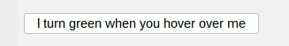

# Climbing The Swing Tree #


Welcome to this Swing Tree tutorial! <br>
Here you will learn how to climb the tree, and Swing.

You do not need any prior knowledge of Swing to follow this tutorial.


## Planting a Seed ##

The first thing you need to do is to import the swing tree dependency into your project.
You can do this by adding the following to your `build.gradle` file
with a valid version number:

```groovy
 dependencies {
     compile 'io.github.globaltcad:swing-tree:x.y.z'
 }
```

Then inside your code you can import 
Swing-Tree by adding the following
import statement:

```java
 import swingtree.UI;
```

This is all you need to start building Swing UIs with the tree. :tada:

## Growing a Stem ##

No matter which UI framework you use, all UIs are built up from
a tree of components. Swing is no different, which is why the Swing-Tree
library allows you to build Swing UIs in a declarative fashion,
just like you would declare your UI structure in HTML or in other XML-based
UI frameworks.

So you build your UI by describing it
using method chaining and nesting based composition 
and then let Swing-Tree
convert this component tree into a Swing UI on the fly.

Here a little example UI that demonstrates this:

```java
 UI.show(
     UI.panel("wrap 1")
     .add(UI.label("Welcome to Swing-Tree!"))
     .add(
         UI.panel("wrap 2")
         .add(UI.label("Enter name:"))
         .add(UI.textField("John Doe"))
         .add(UI.label("Enter age:"))
         .add(UI.textField("42"))
     )
     .add(UI.button("Click to Swing!"))
 );
```

This code will create a Swing UI that looks like this:


As you can see, building UIs with Swing-Tree feels very similar 
to building HTML pages with HTML tags even though everything is
done in plain old Java code. 
All of this is made possible by harnessing the power of 
builder style method chaining
and composition. 
Swing Tree combines this to give you a quasi XML-based UI framework
with compile time type safety, turing completeness and all the
other good stuff that comes with Java.

## Growing Branches ##

The next important step to building Swing UIs with Swing-Tree is
mastering layout managers. 
Swing-Tree has a general purpose layout manager built into it
which is set as the default layout manager if you do not specify
a different one. 

If you know Swing you may already have heard of it:
**The one and only, all mighty, MigLayout**.

MigLayout is a very powerful layout manager that allows you to
specify the layout of your UI based on simple String keywords.
You have already seen this in the example above where we used
the `wrap 1` and `wrap 2` keywords to specify the number of
columns in the layout.

So let's consider the following example:

```java
 UI.show(
     UI.panel("wrap 4, fill, debug")
     .add(UI.label("A"))
     .add(UI.label("B"))
     .add(UI.label("C"))
     .add(UI.label("D"))
     .add(UI.label("E"))
     .add(UI.label("F"))
 );
```
Here we have specified the `wrap 4` keyword to tell the layout
manager to create 4 columns. 
This code will create a Swing UI that looks like this:


Note that we have added the `fill` and `debug` keywords to the
layout manager. The `fill` keyword tells the layout manager
to fill the available space in the container (in this case the window).
The `debug` keyword tells the layout manager to draw some nice borders around
the components to make it easier to see how exactly the layout manager
is arranging the components.

---

For more control over the layout you can also specify the
layout constraints for each component individually.
All you have to do is pass a `String` as the first argument the `add` method.

Here another little example UI:

```java
 UI.show(
     UI.panel("fill, debug")
     .add(UI.label("A"))
     .add("wrap", UI.label("B"))
     .add("span", UI.label("I should span the whole width!"))
     .add(UI.label("C"))
     .add(UI.label("D"))
     .add("wrap", UI.label("E"))
     .add(UI.label("F"))
 );
```

Which will create a Swing UI that looks like this:


Now this is a little bit more complicated than the previous example,
but understanding how the layout manager works is the key to
building beautiful Swing UIs.

Instead of specifying the layout constraints for the whole
container we have now specified the layout constraints for
each component individually.

The `wrap` keyword tells the layout manager to start a new row which
causes the next component to be placed on the next row.
You can think of it as a line break in HTML
or when you use the `println` method in Java instead of `print`.

The `span` keyword on the other hand tells the layout manager
to span the component over all existing columns and then
start a new row.
If you don't want to span over all columns you can specify
the number of columns you want to span over as the second
argument like this: `span 2`.

---

You can find more information about `MigLayout` and all of it's
cool layout keywords on the official
website: [http://www.miglayout.com/](http://www.miglayout.com/)

And if you don't want to use `MigLayout` don't worry,
Swing-Tree is based on Swing and therefore allows you to use
any other layout manager you want.
You can specify the layout manager for a component by using
the `withLayout` method.

## Growing Sprouts ##

Now that we have learned how to build Swing UIs with Swing-Tree
we can start looking at some of the more advanced features
that Swing-Tree provides.

Besides being able to build Swing UIs in a declarative fashion
you can also do clean `MVVM`/`MVC` and `MVP` application development.
These fancy `MVVM`/`MVC`/`MVP` shortcuts all stand for `Model`-`View`-`ViewModel/Controller/Presenter` 
which are all different design patterns for achieving essentially
the same fundamental goal: 

**Separating the UI from the business logic!**

In Swing-Tree you can achieve this separation by using the 
**Sprouts property collection API**.
Properties are a simple yet powerful concept, they are just wrapper types
for the field variables of you view model which allow you register change listeners on them.
These listeners make it possible to dynamically update UI components 
when your business logic mutates the properties, and also to
update the properties when the user interacts with the UI.
This **bidirectional observer/listener pattern** is called **data binding**,
and it is the fundamental building block of `MVVM` application development.

Let's consider the following business logic, which we will call "**view model**" 
from now on in accordance with the `MVVM` design and naming conventions:

```java
import sprouts.Var;

public class PersonViewModel {
    private final Var<String> firstName = Var.of("Joseph");
    private final Var<String> lastName = Var.of("Armstrong");
    private final Var<String> fullName  = Var.of("");
	
    public PersonViewModel() {
        firstName.onAct( it -> fullName.set(it + " " + lastName.get()) );
        lastName.onAct( it -> fullName.set(firstName.get() + " " + it) );
        fullName.set(firstName.get() + " " + lastName.get());
    }
    
    public Var<String> firstName() { return firstName; }
    public Var<String> lastName()  { return lastName;  }
    public Val<String> fullName()  { return fullName;  }
}
```

Properties are represented by the `sprouts.Var` and `sprouts.Val` classes.
They can wrap any kind of value whose type you can specify using the generic 
type parameter. 
In this example we have 3 properties wrapping a String each.
The most important property type is the `Var` type.
It has both getters and setters for the wrapped value. 
The `Val` type on the other hand is an immutable property / read-only view of a `Var`.
Note that `Var` is a subtype of `Val`, which allows you to 
design your view model API in a way which does
not leak mutable state to the outside world. :partying_face:

Now let's consider the corresponding Swing UI:

```java
 var vm = new PersonViewModel();
 UI.show(
    UI.panel("wrap 2")
    .add(UI.label("First Name:"))
    .add("grow", UI.textField(vm.firstName()))
    .add(UI.label("Last Name:"))
    .add("grow", UI.textField(vm.lastName()))
    .add("span", UI.separator())
    .add("wrap", UI.label("Full Name:"))
    .add("span, grow", UI.textField(vm.fullName()))
 );
```

This will look like this:


Swing-Tree will bind the `firstName` and `lastName` properties
of the `PersonViewModel` to the `JTextField` components
and will automatically update the `JTextField` components
whenever the `firstName` or `lastName` properties change (their `set` methods are called).
Conversely, whenever the user changes the text in the `JTextField`
components the `firstName` and `lastName` properties will be updated
as well, which will in turn trigger the `onAct` callbacks!
In this example the `onAct` change listener will set the `fullName` property,
which will automatically translate to the corresponding `JTextField` component in the UI.

The powerful thing about this example is that we managed 
to affect the state of the UI (the full name) without
actually depending on the UI at all,
meaning that **there is not even a single reference to a Swing component**
in the `PersonViewModel` class!

Not only does this allow us to write **unit tests** for our business logic
we can now also **easily swap out the Swing UI for a different UI**
implementation without having to change the business logic at all!

How cool is that? :)

If you want to dive deeper into doing MVVM in Swing-Tree,
check out the [MVVM tutorial](./Advanced-MVVM.md).

## Growing Leaves ##

The next step in mastering Swing-Tree is to learn how to
register user events in your declarative Swing UIs.
For different types of Swing components you can register
different types of user events.
But for all Swing components you can register the same
basic set of events like for example:

```java
  UI.panel("fill").withPrefSize(400, 400)
  .onMouseEnter( it -> System.out.println("Mouse entered panel") )
  .onMouseExit( it -> System.out.println("Mouse exited panel") )
  .onMousePress( it -> System.out.println("Mouse pressed panel") )
  .onMouseRelease( it -> System.out.println("Mouse released panel") )
  .onMouseClick( it -> System.out.println("Mouse clicked panel") )
  .onMouseDrag( it -> System.out.println("Mouse dragged panel") )
  .onFocusGained( it -> System.out.println("Panel gained focus") )
  .onFocusLost( it -> System.out.println("Panel lost focus") )
  ...
``` 

Note that every event handler receives a special `it` parameter!
This is a delegate for both the Swing component and the current
event state. Not only can you use this delegate to access the 
Swing component, and the current event state, but you can also
use it to query the whole UI tree for other components,
schedule animations, and much much more!

Just keep reading and you will see what I mean! :)


## Harvesting Fruit ##

The final step in mastering Swing-Tree are animations.
Yes you heard me right, Swing-Tree supports animations
and advanced custom rendering for all Swing components 
out of the box!

Check out this basic example:



Which is based on the following code:

```java
  button("I turn green when you hover over me")
  .onMouseEnter( it ->
      it.animateOnce(0.5, TimeUnit.SECONDS, state -> {
          double highlight = 1 - state.progress() * 0.5;
          it.setBackgroundColor(highlight, 1, highlight);
      })
  )
  .onMouseExit( it ->
      it.animateOnce(0.5, TimeUnit.SECONDS, state -> {
          double highlight = 0.5 + state.progress() * 0.5;
          it.setBackgroundColor(highlight, 1f, highlight);
      })
  )
```

As you can see, animations are very easy to create, 
especially when you use the `animateOnce` method
on the previously
mentioned event/component delegate object, 
which in the above example
is the `it` variable.

One thing that might confuses you is the fact that there are 
2 nested lambdas in the 2 `onMouseEnter` and `onMouseExit` callbacks.
The **outer lambda is the event handler** which is called once whenever
the mouse enters or leaves the button. **The inner lambda is the actual
animation** which is called repeatedly until the animation
is finished (which happens after 0.5 seconds in this case).
So the inner lambda is called any number of times 
but usually not more than **~60 times per second**.

Another confusing thing might be the `state` parameter
of the animation callback. This is an `AnimationState` object
which contains information about 
**the state of the current animation update**.
This object exists to tell you how far along the animation is,
and to provide you with some useful methods for designing
animations with seemless and controlled transitions.

You might be wondering: How does all of this work under the hood? 
Well, in essence it is based on a custom `Timer` implementation,
some system time bookkeeping,
and a nice API for creating and scheduling animation lambdas,
that's all. :)

The next example demonstrates how to do custom rendering
in your animations:


Which is based on this code:

```java
  button("I have a click ripple effect")
  .onMouseClick( it -> it.animateOnce(2, TimeUnit.SECONDS, state -> {
      it.render( g -> {
          g.setColor(new Color(0.1f, 0.25f, 0.5f, (float) state.fadeOut()));
          for ( int i = 0; i < 5; i++ ) {
              double r = 300 * state.fadeIn() * ( 1 - i * 0.2 );
              double x = it.getEvent().getX() - r / 2;
              double y = it.getEvent().getY() - r / 2;
              g.drawOval((int) x, (int) y, (int) r, (int) r);
          }
      });
  }))
```

Note that the `render` method is called repeatedly
until the animation is finished. The `render` method
accepts a lambda which is called with a `Graphics2D` object
that you can use to draw on the component.

I hope you are starting to see the power of this.
Just to give you an idea of what you can do with this,
here is a more complex example:


```java
  button("I show many little mouse move explosions when you move your mouse over me")
  .withPrefHeight(100)
  .onMouseMove( it -> it.animateOnce(1, TimeUnit.SECONDS, state -> {
          double r = 30 * state.fadeIn();
          double x = it.getEvent().getX() - r / 2.0;
          double y = it.getEvent().getY() - r / 2.0;
          it.render( g -> {
              g.setColor(new Color(1f, 1f, 0f, (float) state.fadeOut()));
              g.fillOval((int) x, (int) y, (int) r, (int) r);
          });
  }))
  .onMouseClick( it -> it.animateOnce(2, TimeUnit.SECONDS, state -> {
      double r = 300 * state.fadeIn();
      double x = it.getEvent().getX() - r / 2;
      double y = it.getEvent().getY() - r / 2;
      it.render( g -> {
          g.setColor(new Color(1f, 1f, 0f, (float) state.fadeOut()));
          g.fillOval((int) x, (int) y, (int) r, (int) r);
      });
  }))
```

The above example shows how to create a button
that has both a mouse move and a mouse click animation
which are very similar to each other.
The only difference is that the radius of the expanding circle
is far larger when the user clicks the button.


