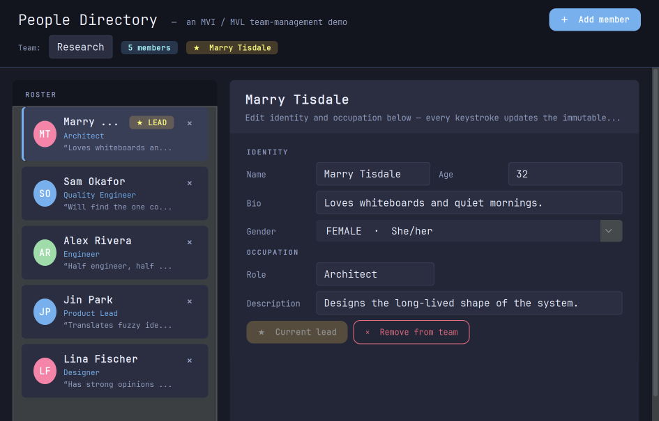
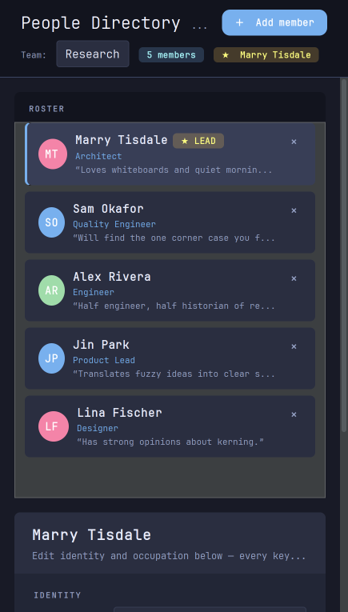
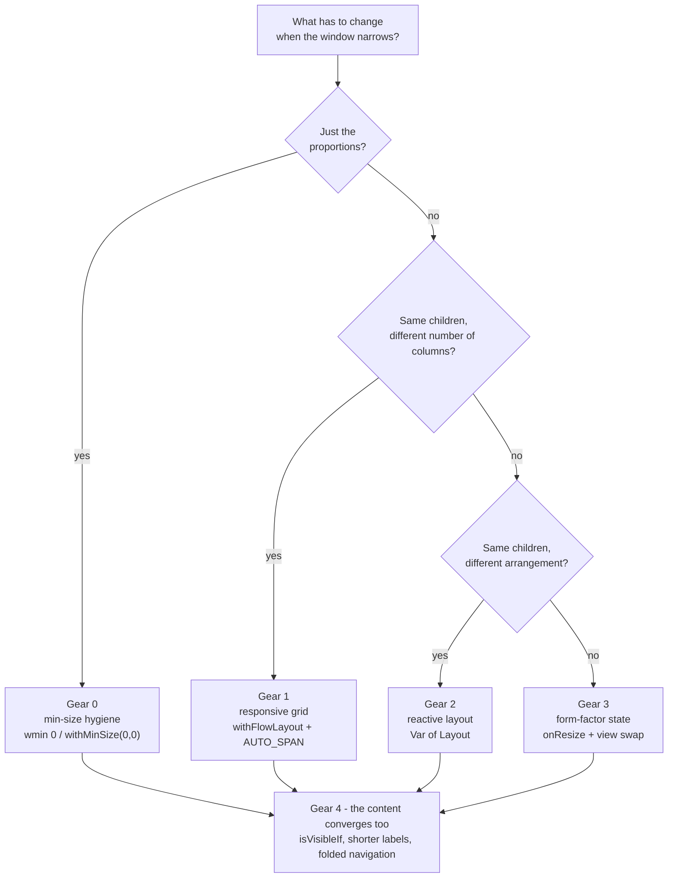
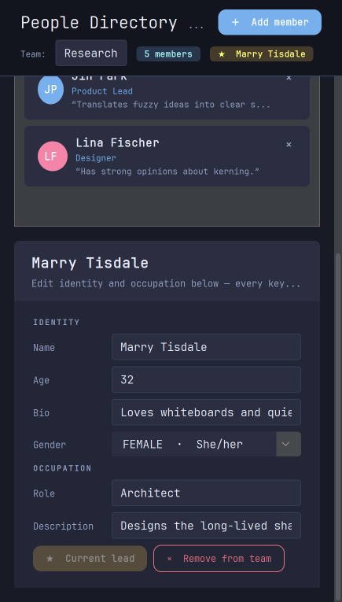
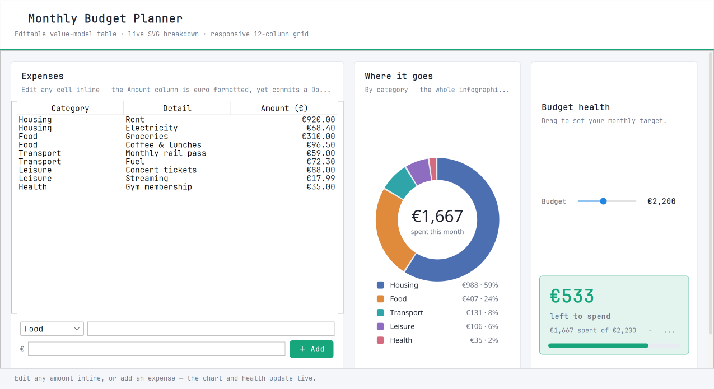
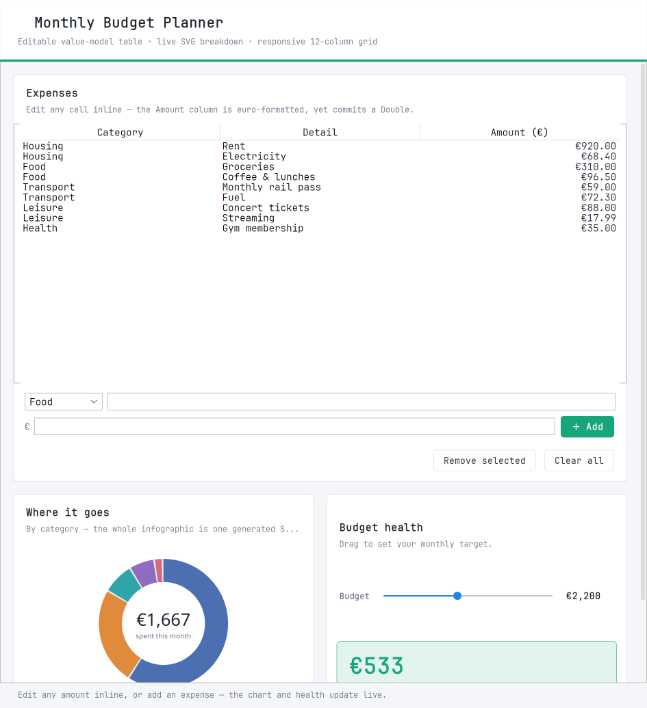
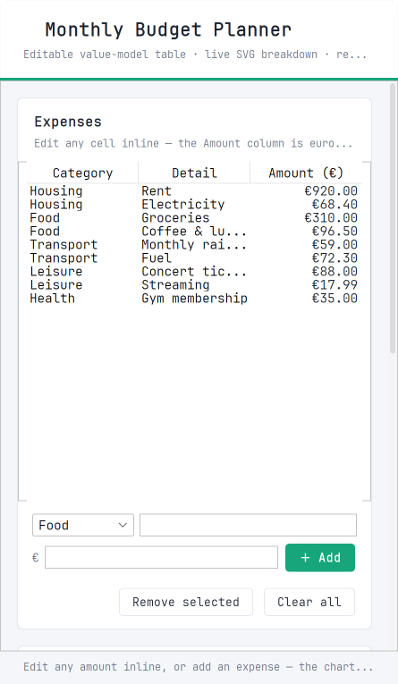

# Convergent Design #

> **Prerequisites:** [Climbing the Swing Tree](./Climbing-Swing-Tree.md) for the
> basics of declarations and MigLayout constraints. This guide is the *why* and
> the *strategy*; [Responsive Layouts](./Responsive-Layouts.md) is the mechanics
> of the 12-column grid it leans on most, and
> [Reactive Layouts](./Reactive-Layouts.md) covers `Var<Layout>`.

## Your window is not 1920×1080 ##

Somewhere in the design of almost every desktop application there is an
unwritten assumption: *the user will run this maximised, on a landscape monitor,
at roughly the size I had my IDE window at when I built it.*

That assumption has been quietly false for years.

- People run **tiling window managers** — i3, sway, Hyprland, yabai, AeroSpace,
  PowerToys FancyZones, or just macOS/Windows snap. Your app gets a third of a
  screen, or a tall vertical strip, and it does not get a vote.
- People run **ultrawide monitors** and put four windows side by side, each
  600 px across.
- People **rotate a monitor into portrait** for reading and code review, and
  then open your app on it anyway.
- People drag a window to a **second, smaller screen**, share it in a video
  call at a reduced size, or run it in a VM window pinned to half the desktop.




*The same view, the same code, the same view model — dragged into two very
different shapes. That is the whole idea.*

Web developers solved this fifteen years ago and gave it a name. Mobile
developers solved it and gave it a *better* name: **convergence** — a single
application that is genuinely usable across the whole range of shapes it might
be handed, rather than one that merely refuses to crash.

Desktop toolkits have mostly been left out of that conversation, and it shows:
the classic Swing failure mode is a window with a hard minimum size, a form
whose labels are clipped at 900 px, and a master–detail split where the detail
pane becomes a 40-pixel sliver.

**SwingTree treats convergence as the default expectation, not a stretch goal.**
It ships four different mechanisms for it, and this guide is about choosing
between them.

---

## Responsive is not the same as convergent ##

The two words get used interchangeably, and the difference is worth keeping.

|  | Responsive | Convergent |
|---|---|---|
| Promise | The layout *reacts* to size | The app stays *usable* at every size |
| Failure mode | Nothing overlaps | Nothing is lost |
| Typical fix | `growx`, `fill` | rearrange, re-prioritise, sometimes restructure |
| Scope | Layout only | Layout **and** content **and** navigation |

A form whose text fields stretch is responsive. A form that stretches, then
pairs its short fields two per row when there is room, then falls back to one
column and lets the page scroll when there is not — and never hides the Save
button in the process — is convergent.

The distinction matters because responsiveness is something you can bolt on at
the end, and convergence is not. It is a property of how you *decomposed* the
view in the first place.

---

## The four gears ##

SwingTree gives you four mechanisms. They are not alternatives so much as
gears — you shift up as the required change gets more drastic, and a real app
usually uses two or three of them at once.



### Gear 0 — first, let the thing shrink ###

This is not glamorous and it is where nine out of ten "my layout won't
converge" bugs actually live.

**A Swing component's minimum size is a hard floor**, and containers propagate
it upwards. A `JLabel`'s minimum width is the full width of its text. A
`MigLayout` cell's minimum is the child's minimum. Stack a dozen of those and
your *window* has acquired a minimum width of 1100 px that no amount of clever
grid configuration can defeat — the layout manager is never even given the
chance to reach its narrow arrangement.

The fix is one MigLayout constraint, applied liberally:

```java
.add("growx, wmin 0", label("A rather long descriptive caption"))
```

`wmin 0` says *this child may be given less width than it would like.* For a
label that means it ellipsizes (`"A rather long descrip…"`) instead of acting
as a strut. Put it on every row of a container that must be allowed to narrow,
and on the containers themselves — minimums propagate, so one forgotten row
deep in the tree re-establishes the floor.

The responsive flow grid has a matching trap: **its minimum width is the sum of
all its children's minimum widths**, so a page grid holding three cards reports
"three cards wide" as its minimum. Say what you actually mean:

```java
UI.panel().withFlowLayout(UI.HorizontalAlignment.LEFT, 18, 18)
.withMinSize(0, 0)          // this page may shrink to whatever it is given
```

> **Rule of thumb:** before you reach for any of the gears below, drag the
> window as narrow as it will go. If it stops at some arbitrary width, you have
> a minimum-size problem, not a layout problem. Fix that first — everything
> else is downstream of it.

### Gear 1 — the responsive grid (no state at all) ###

This is the workhorse, and the one to reach for by default. Put the top-level
regions of a page into a flow layout and let each declare how many of 12
virtual columns it wants at each *size category*:

```java
private static final FlowCell ROSTER_SPAN = AUTO_SPAN( it -> it.fill(true)
        .verySmall(12).small(12).medium(12).large(5).veryLarge(4).oversize(4) );

private static final FlowCell EDITOR_SPAN = AUTO_SPAN( it -> it.fill(true)
        .verySmall(12).small(12).medium(12).large(7).veryLarge(8).oversize(8) );

UI.panel().withFlowLayout(UI.HorizontalAlignment.LEFT, 18, 18)
.withMinSize(0, 0)
.withPrefSize(PAGE_REFERENCE_WIDTH, 0)
.add(ROSTER_SPAN, roster(vm))
.add(EDITOR_SPAN, editor(vm))
```

Read that span table out loud and you have the entire responsive design of the
page: *roster beside the editor from LARGE upwards, one stacked column below
that.* No breakpoint field, no resize listener, no second version of the view,
nothing added to the view model. The categories are **fractions of the grid's
own reference width**, so they follow your content instead of being hard-coded
pixel values.

The full mechanics — reference widths, nesting, `fill`, the vertical-height
rule — are in [Responsive Layouts](./Responsive-Layouts.md). The one thing to
carry over here: **a flow grid gives every row the height of its tallest
child**, it never stretches a row to fill a tall window. So once the cards
stack, the page is taller than the window, and the page belongs in a scroll
pane:

```java
UI.scrollPane( conf -> conf.fitWidth(true) )
.withHorizontalScrollBarPolicy(UI.Active.NEVER)
.withVerticalScrollIncrement(24)
.add( thePageGrid )
```

That single wrapper is what turns "stacked and clipped" into "stacked and
scrollable" — the phone-shaped reading experience people already expect.

### Gear 2 — reflow without rebuilding (`Var<Layout>`) ###

Sometimes the change is not *how many columns* but *a genuinely different
arrangement of the same widgets*: a toolbar that is one long row when wide and
three short rows when narrow; a status bar whose counters wrap. A 12-column
grid is the wrong tool for that, because the widgets are not interchangeable
cards — their order and grouping carry meaning.

Bind the panel's **layout itself** to a property and swap the whole arrangement
atomically:

```java
private static final Layout WIDE_TOOLBAR =
        Layout.mig("fill, ins 0", "[][240px:300px,grow][][grow,fill][][]", "")
              .withChildConstraints(
                  MigAddConstraint.of(""),        // "STATION"
                  MigAddConstraint.of("growx"),   // search field
                  MigAddConstraint.of(""),        // Search button
                  /* ... one entry per child, positionally ... */);

private static final Layout TALL_TOOLBAR =
        Layout.mig("fill, wrap 3, ins 0", "[][grow][]", "")
              .withChildConstraints( /* the same seven widgets, three rows */ );

panel(toolbarLayout)   // Val<Layout> derived from the form factor
.add(label("STATION"))
.add(GROW_X, textField(query))
/* ... */
```

The decisive property here is that **nothing is rebuilt**. The search field
keeps its focus, its caret position and its selection across the reflow; a
`JTabbedPane` keeps its selected tab; a scrolled log keeps its scroll offset.
If you rebuilt the subtree instead, a user typing while dragging a window edge
would lose their cursor mid-word.

Two things to know:

- Child constraints are applied **positionally**, and only overwritten where a
  new layout supplies one. So every variant must spell out a constraint for
  *every* child — a gap leaves the previous variant's constraint (a stray
  `"wrap"`, say) in place after switching back.
- MigLayout is a grid, so in a wrapped variant every row's columns line up with
  every other row's. Add `nogrid` to the container constraint when you want the
  rows to simply flow.

See [Reactive Layouts](./Reactive-Layouts.md) for the full `Layout` API.

### Gear 3 — swap the structure (form-factor state) ###

The highest gear, for when the two shapes want genuinely different component
trees. The canonical case is a **split pane**: two independently scrolling
panes side by side is a great landscape design and a terrible portrait one,
where you want one page that scrolls top to bottom instead.

Classify the shape into a small enum, keep it in the view model like any other
state, and let one property-bound `add` swap the body:

```java
public enum Formfactor {
    WIDE, TALL;

    /** A 10% dead band around the square, or dragging a corner along the
     *  diagonal flips the layout many times per second. */
    public static Formfactor of( int width, int height, Formfactor current ) {
        double slack = 1.1;
        if ( current == TALL ) return width  > height * slack ? WIDE : TALL;
        else                   return height > width  * slack ? TALL : WIDE;
    }
}
```

```java
of(this).withLayout(FILL.and(WRAP(1)))
.onResize( it -> formfactor.update(From.VIEW, f -> Formfactor.of(it.getWidth(), it.getHeight(), f)) )
.add(GROW.and(PUSH), formfactor, this::body);   // rebuilds only on a shape change
```

Three things make this behave:

1. **Hysteresis.** Without the dead band, a width that sits exactly on the
   boundary oscillates as the layout it chooses changes the size it was chosen
   from. (Gears 1 and 2 don't need this — reflowing never changes the width it
   was measured against.)
2. **The form factor is ordinary state**, not a Swing field. That means "which
   shape are we in" is unit-testable without a GUI, and every other part of the
   view is a pure function of it.
3. **It fires at most once per shape change**, because `Var.update(..)` is a
   no-op when the value is unchanged — `onResize` runs on every pixel of a
   drag, the rebuild does not.

Use this gear sparingly. It is the only one that throws away component state,
so anything the user is *in the middle of* — a caret, a selection, a scroll
position — is lost across the switch. Reach for gear 2 first and only escalate
when the structures really differ.

### Gear 4 — the content converges too ###

Layout is only half of it. A convergent view also **re-prioritises what it
says**, and in SwingTree that is just ordinary property binding — no layout
machinery involved:

```java
// the tag line is the first thing to go when room runs out
.add(GROW_X.and("wmin 0"),
    label("Live timetable · click any train to reveal its full route")
    .isVisibleIf(isWide))

// the button says less, but still says it
Val<String> themeButtonText = Viewable.of(String.class, theme, formfactor, (t, f) ->
        f.isTall() ? ( t.isDark() ? "☀" : "☾" )
                   : ( t.isDark() ? "☀  Light mode" : "☾  Dark mode" ));
```

Add `hidemode 3` to the container constraint so a hidden child stops reserving
its cell, and the row genuinely closes up.

Deciding *what* to drop is a design question, not a technical one, but there is
a reliable heuristic: **drop what is redundant before you drop what is
unique.** A station name that already appears in the toolbar and the status bar
can leave the card header. A subtitle that only re-states the title can go. The
one thing the user came for stays, at every size.

---

## A worked example: master–detail ##

Master–detail is the layout most likely to break, so it makes a good
walkthrough. The full source is
[`examples/team/mvi/TeamView.java`](../../src/test/java/examples/team/mvi/TeamView.java)
(and its MVVM twin in `examples/team/mvvm/` — the convergence code is
character-for-character identical, which is itself the point: convergence is a
property of the view tree, not of your state-management pattern).

**Step 1 — decide what the shapes are.** Wide: roster on the left, editor on
the right. Narrow: roster on top, editor below, page scrolls. That is a Gear 1
job — same two children, different column counts.

**Step 2 — write the span table.** It *is* the design document:

```java
private static final int PAGE_REFERENCE_WIDTH = 900;

private static final FlowCell ROSTER_SPAN = AUTO_SPAN( it -> it.fill(true)
        .verySmall(12).small(12).medium(12).large(5).veryLarge(4).oversize(4) );

private static final FlowCell EDITOR_SPAN = AUTO_SPAN( it -> it.fill(true)
        .verySmall(12).small(12).medium(12).large(7).veryLarge(8).oversize(8) );
```

`fill(true)` makes both cards stretch to the height of the taller one while
they share a row, so the editor card doesn't end halfway down beside a tall
roster.

**Step 3 — put the page in a scroll pane** so the stacked arrangement can be
taller than the window (Gear 1's height rule).

**Step 4 — give the pieces that have no natural size one.** A `scrollPanels`
has almost no preferred *height* of its own, and in a flow grid a card is
exactly as tall as it prefers — so the roster would collapse to a single line
the moment it stacked:

```java
UI.scrollPanels().withPrefSize(340, 470)
.addAll(members, (Var<Person> personVar) -> memberCard(personVar, vm))
```

**Step 5 — converge the detail pane too.** The editor's form is its own,
*nested* responsive grid: short fields (Name, Age, Role) pair up two per row
while the editor is wide, and fall into a single column as soon as it is not.

```java
private static final FlowCell FULL_ROW = AUTO_SPAN( it -> it
        .verySmall(12).small(12).medium(12).large(12).veryLarge(12).oversize(12) );

private static final FlowCell HALF_ROW = AUTO_SPAN( it -> it
        .verySmall(12).small(12).medium(12).large(12).veryLarge(6).oversize(6) );

UI.panel().withFlowLayout(UI.HorizontalAlignment.LEFT, 12, 8)
.withMinSize(0, 0)
.withPrefSize(FORM_REFERENCE_WIDTH, 0)   // its own reference width — see below
.add(FULL_ROW, sectionTitle("Identity"))
.add(HALF_ROW, field("Name", inlineTextField(name)))
.add(HALF_ROW, field("Age",  inlineNumericField(age)))
.add(FULL_ROW, field("Bio",  inlineTextField(bio)))
```

Each `field(..)` is a tiny MigLayout unit holding a label and its input, so a
field never splits across a row boundary — only the *arrangement* of whole
fields changes.

> ⚠️ **The nesting rule that will bite you.** A grid inside a grid works. A grid
> inside a plain `MigLayout` cell does **not** — a wrapping grid can only report
> an honest height to a parent that asks it the width-for-height question, and a
> MigLayout cell asks for a plain preferred height instead. Combined with the
> `withPrefSize(refWidth, 0)` idiom above, that literal `0` is what MigLayout
> reads back, and the grid collapses to nothing.
>
> That is why the editor **card** in `TeamView` is a grid too, and not the
> MigLayout panel it looks like it could be. See
> [Responsive Layouts → Nesting](./Responsive-Layouts.md#nesting-grids-and-the-reference-width).

**Step 6 — sprinkle `wmin 0`** down every row that must be allowed to narrow,
and confirm by dragging the window as small as it goes.

The result, at three sizes:




And the same idea applied to a dashboard —
[`examples/budget/mvi/BudgetView.java`](../../src/test/java/examples/budget/mvi/BudgetView.java)
converges through four arrangements with nothing but a span table:





---

## The convergence checklist ##

Run through this before you call a view finished. It is also a decent code
review checklist.

**Can it shrink?**
- [ ] Drag the window to its smallest. Does it stop somewhere arbitrary? Find
      the missing `wmin 0` / `withMinSize(0, 0)`.
- [ ] Long labels ellipsize rather than acting as struts.
- [ ] Nothing uses `width 200!` where `width 90::200` would do.

**Does it rearrange?**
- [ ] Multi-column regions collapse to one column instead of becoming slivers.
- [ ] A stacked page lives in a `scrollPane(conf -> conf.fitWidth(true))`, so
      it can be taller than the window.
- [ ] Anything with no natural preferred size (`scrollPane`, `scrollPanels`, an
      empty `textField`) has been given one.

**Does it stay usable?**
- [ ] The primary action is reachable at every size — not pushed off an edge,
      not scrolled past.
- [ ] What disappears when narrow is *redundant*, not unique.
- [ ] Nothing important is only reachable by horizontal scrolling.

**Does it survive the transition?**
- [ ] A view swap (Gear 3) has hysteresis, so dragging along the diagonal
      doesn't strobe.
- [ ] Focus, caret and selection survive a reflow (prefer Gear 2 over Gear 3
      where you can).
- [ ] Every `Var<Layout>` variant spells out a constraint for *every* child.

---

## Testing convergence ##

Convergence is unusually easy to test for a UI property, because you can just
lay the thing out and look at the numbers — no screenshots required:

```groovy
given : 'A view, laid out at a narrow size.'
    var ui = UI.runAndGet({ TeamView.createView() })
    ui.setSize(UI.scale(520), UI.scale(900))
    ui.doLayout()

expect : 'The editor card is not clipped away.'
    findEditorCard(ui).getHeight() > 0
```

Two habits make this pay off:

1. **Assert on geometry, not pixels.** "This panel has a non-zero height",
   "this label is narrower than its parent", "these two cards do not overlap" —
   all stable across platforms, fonts and LAFs in a way that a screenshot
   comparison is not.
2. **Test the narrow case specifically.** The wide case is the one you
   developed in and the one that works by accident. Every convergence bug in
   this repo's own examples was found by making a window tall and thin.

And when a form factor lives in the view model (Gear 3), it stops being a UI
concern at all:

```groovy
expect : Formfactor.of(1200, 800, Formfactor.WIDE) == Formfactor.WIDE
and    : Formfactor.of( 600, 900, Formfactor.WIDE) == Formfactor.TALL
and    : 'The dead band holds the current shape near the square.'
    Formfactor.of(800, 820, Formfactor.WIDE) == Formfactor.WIDE
    Formfactor.of(800, 820, Formfactor.TALL) == Formfactor.TALL
```

---

## Conclusion ##

Convergence is not a feature you add to a desktop app; it is a decision you
make about how the view is decomposed, and then a handful of small, cheap
mechanisms that express it:

- **Gear 0** — minimum-size hygiene, so the layout is allowed to try.
- **Gear 1** — the 12-column responsive grid, for pages of interchangeable
  regions. **Stateless, and the right default.**
- **Gear 2** — `Var<Layout>`, for reflowing widgets whose grouping matters,
  without losing focus or selection.
- **Gear 3** — a form factor in the view model, for structurally different
  shapes.
- **Gear 4** — property-bound content that re-prioritises itself.

Most views need gear 0 plus gear 1. Reach higher only when the shape of the
problem demands it.

## Where to next? ##

- [Responsive Layouts](./Responsive-Layouts.md) — the full mechanics of the
  12-column grid: size categories, reference widths, nesting, and the traps.
- [Reactive Layouts](./Reactive-Layouts.md) — the `Var<Layout>` API behind
  gear 2, including `Layout.none()` for data-derived positioning.
- [Functional MVVM](./Functional-MVVM.md) — where a form factor lives when it
  is part of an immutable view model.
- [HiDPI Scaling](./HiDPI-Scaling.md) — the other half of "works on any
  screen": developer pixels vs component pixels.

Runnable examples that converge, in rough order of how much machinery they use:

| Example | Gears | What to look at |
|---|---|---|
| [`budget/mvi/BudgetView`](../../src/test/java/examples/budget/mvi/BudgetView.java) | 0, 1 | Four arrangements of three cards from one span table. |
| [`zen/ThemeGardenView`](../../src/test/java/examples/zen/ThemeGardenView.java) | 0, 1 | A media player that stacks; also five hot-swappable themes. |
| [`animated/AnimatedView`](../../src/test/java/examples/animated/AnimatedView.java) | 0, 1 | A **nested** grid — the recipe list is a column as a sidebar, a chip grid when stacked. |
| [`team/mvi/TeamView`](../../src/test/java/examples/team/mvi/TeamView.java) | 0, 1 | Master–detail with a nested responsive *form*; the walkthrough above. |
| [`breathing/mvi/BreathingView`](../../src/test/java/examples/breathing/mvi/BreathingView.java) | 0, 1 | Convergence plus size-relative *painting* — the orb is sized from its box, not in pixels. |
| [`almanack/mvi/AlmanackView`](../../src/test/java/examples/almanack/mvi/AlmanackView.java) | 0, 2, 4 | Four breakpoints feeding four `Val<Layout>` properties; nothing is ever rebuilt. |
| [`trains/mvi/TrainsView`](../../src/test/java/examples/trains/mvi/TrainsView.java) | 0, 2, 3, 4 | A `Formfactor` in the view model, a split pane ⇄ scrolling column swap, and a reactive toolbar. |
