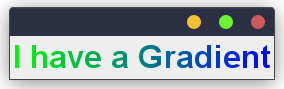
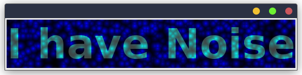

# Font Styling # 

You may have come to believe that in plain old Swing,
the `java.awt.Font` class only supports the utter most basic styling properties
like font size, font family, bold, and italic. But that's not true.
It turns out there is a whole range of interesting map based styling properties
that you can configure using the `java.awt.font.TextAttribute` type.
For example, instead of a plain `java.awt.Color` object, you can use any
other `java.awt.Paint` object to color your text using the 
`java.awt.font.TextAttribute.FOREGROUND` attribute.
This means that in theory you could use a `java.awt.GradientPaint` or other more complex
paints to color your text. 

The problem with all of this however is that this API is not at all user-friendly.
When reading the documentation of the `Font` class it is hard to actually find
these properties. And even if you do find them, it is not clear how to use them
together with the property map exposed by the `Font::getAttributes` method.

SwingTree solves this problem by also modelling these properties
as part of the style API. This declarative approach to font styling
makes styling your fonts both composable and more readable.

## Advanced Component Font Styling ##

Every Swing component has a font.
To configure the style of this default component font
through the SwingTree style API you can use the `componentFont` sub-style like so:

```java
  .withStyle( it -> it
      .padding(3)
      .borderRadius(12)
      .componentFont(fontConf->fontConf
          .size(32)
          .family("Arial")
      )
  );
```

This exposes the `FontConf` object which offers a wide range of font styling properties.


### Gradient Font ###

One of the more interesting properties you can configure is the `gradient` sub-style.
Consider the following example:

```java
  UI.label("I have a Gradient")
  .withStyle( it -> it
      .padding(3)
      .borderRadius(12)
      .componentFont(f->f
          .size(32)
          .family("Arial")
          .gradient(grad -> grad
              .colors(Color.GREEN, Color.BLUE)
              .span(UI.Span.LEFT_TO_RIGHT)
              .type(UI.GradientType.LINEAR)
          )
      )
  );
```

This will create a label with a gradient colored font
which looks like this:



Note that inside the `gradient` font sub-style you can
access and configure the `GradientConf` object which represents
a `java.awt.Paint` object implementation.
This may be a `java.awt.LinearGradientPaint` or any other paint
that you can think of.

### Noise Gradient Font ###

Another interesting paint based configuration is the `noise` sub-style.
This will create a font that is filled with a noise pattern
based on a `NoiseFunction` implementation.

This style configuration is demonstrated in
the following example code:

```java
  UI.label("I have Noise")
  .withStyle( it -> it
      .padding(3)
      .borderRadius(12)
      .componentFont(f->f
          .size(82)
          .family("Dialog")
          .weight(2.75)
          .color(Color.WHITE)
          .noise(noise -> noise
              .colors(Color.DARK_GRAY, Color.CYAN)
              .function(UI.NoiseType.CELLS)
              .scale(1.25)
          )
          .backgroundNoise(noise -> noise
              .colors(Color.BLACK, Color.BLUE)
              .function(UI.NoiseType.CELLS)
              .scale(1.25)
          )
      )
  );
```

Note that here we not only configure a noise for the foreground
paint of the font, but also for the background.
This will create a font that looks like this:



Both noise paints are configured almost the same way,
except for the choice of colors and due to the fact that 
the noise is generated deterministically based on the pixel positions
you get this fascinating effect of the font growing out of the noise.