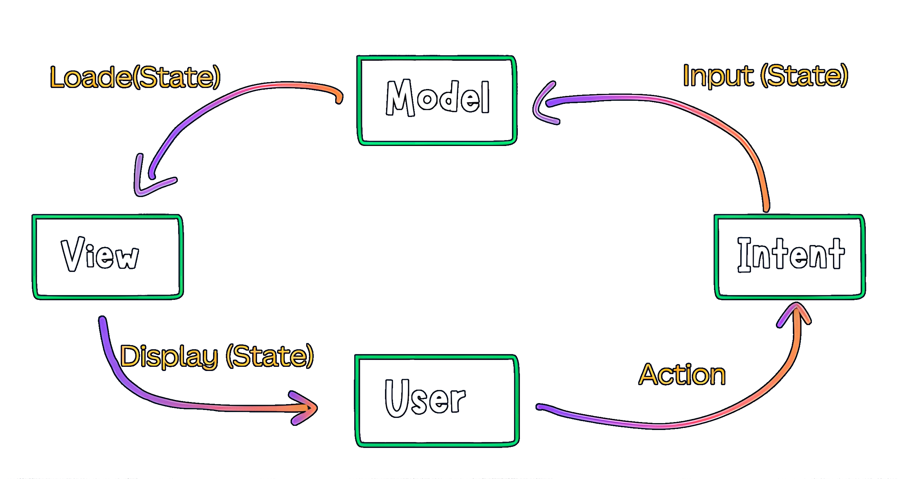
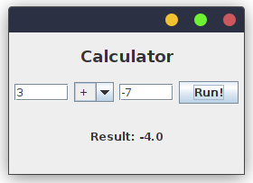

# MVVM / MVI / MVL # 

> This guide is strongly related to the [Advanced MVVM](Advanced-MVVM.md) guide.
> You may want to check it out later if you are not familiar with the MVVM pattern.
> But, you do not need to know about MVVM to understand this guide.



One of the most powerful feature built into SwingTree
and its [property API](https://github.com/globaltcad/sprouts)
is the ability to design various M-V-*x* architectures, like the 
classical MVVM (Model-View-ViewModel) pattern, the MVP (Model-View-Presenter) 
pattern and the age-old MVC (Model-View-Controller).

In this guide we will focus on two new patterns that are specifically
recommended to be used when writing SwingTree applications.
These two architecture pattern derived from MVVM
architecture and therefore very similar to it, but with one big
difference: immutable view models.

Yes, you heard right: **immutable** view models.

This may sound like a contradiction since the view model
defines the state of the UI and the UI changes over time
based on the user's input and application logic. <br>
But it turns out that in the world of functional programming
where large nested immutable data structures are used to model
all kinds of complex systems, the problem of updating 
these data structures effectively has long been solved by
using techniques such as *structural sharing*, *withers*, *event sourcing*
and *lenses*. 

Applying these patterns to the MVVM architecture gives rise
to a new kind of MVVM architecture that is also known as
the **MVI (Model-View-Intent)** architecture and more specifically
the SwingTree derivative **MVL (Model-View-Lenses)**. ✨

But let's not get lost in a sea of buzzwords <br>
and first look at a simple example to see 
how this works in practice:

## A simple MVI/MVL example ##

Let's say we have a simple calculator UI with two input fields,
an operator selector and a result label.
The full view model code for this example 
is fairly straight forward:

```java
public enum Operator {
    ADD, SUBTRACT, MULTIPLY, DIVIDE
}

public record CalculatorInputs(
    String left, String right, Operator operator
){
    public static CalculatorInputs empty(){return new CalculatorInputs("", "", Operator.ADD);}
    public CalculatorInputs withLeft(String left){return new CalculatorInputs(left, right, operator);}
    public CalculatorInputs withRight(String right){return new CalculatorInputs(left, right, operator);}
    public CalculatorInputs withOperator(Operator operator){return new CalculatorInputs(left, right, operator);}
}

public record CalculatorOutput(
    double result, boolean valid, String error
){
    public static CalculatorOutput empty(){return new CalculatorOutput(0, false, "");}
    public CalculatorOutput withResult(double result){return new CalculatorOutput(result, valid, error);}
    public CalculatorOutput withValid(boolean valid){return new CalculatorOutput(result, valid, error);}
    public CalculatorOutput withError(String error){return new CalculatorOutput(result, valid, error);}
}

public record CalculatorViewModel(
    CalculatorInputs inputs, CalculatorOutput output
){
    public static CalculatorViewModel empty(){return new CalculatorViewModel(CalculatorInputs.empty(), CalculatorOutput.empty());}
    public CalculatorViewModel withInputs(CalculatorInputs inputs){return new CalculatorViewModel(inputs, output);}
    public CalculatorViewModel withOutput(CalculatorOutput output){return new CalculatorViewModel(inputs, output);}
    public CalculatorViewModel runCalculation(){
        try{
            double left = Double.parseDouble(inputs.left());
            double right = Double.parseDouble(inputs.right());
            double result = switch(inputs.operator()){
                case ADD      -> left + right; case SUBTRACT -> left - right;
                case MULTIPLY -> left * right; case DIVIDE   -> left / right;
            };
            return withOutput(output.withResult(result).withValid(true));
        } catch ( NumberFormatException e ) {
            return withOutput(output.withError("Invalid number format").withValid(false));
        } catch ( ArithmeticException e ) {
            return withOutput(output.withError("Division by zero").withValid(false));
        }
    }
}
```

This code defines three immutable record classes
that represent the state of the whole calculator UI.
The `CalculatorInputs` record holds the input values
of the two input fields and the selected operator.
The `CalculatorOutput` record holds the result of the calculation,
a boolean flag indicating if the calculation was successful
and an error message if the calculation failed.

What distinguishes these records from regular Java beans
is that they are immutable and have no setters,
instead they have "withers", which are the equivalent
to "setters" in the world of immutable data structures
and functional programming.
Even the `runCalculation` method returns a new instance
of the `CalculatorViewModel` with the updated output
record, instead of modifying the existing instance.

### The View ###

This is all nice and good, but **how do we connect this to the UI?** <br>
The key is the `Var` class from the Sprouts library
and the previously mentioned *withers* of the view model records. <br>
Check out the following code snippet:

```java
import static swingtree.UI.*;

public static class CalculatorView extends JPanel {
    public CalculatorView(Var<CalculatorViewModel> vm) {
        Var<CalculatorInputs> inputs = vm.zoomTo(CalculatorViewModel::inputs, CalculatorViewModel::withInputs);
        Var<CalculatorOutput> output = vm.zoomTo(CalculatorViewModel::output, CalculatorViewModel::withOutput);
        UI.of(this).withLayout("fill")
        .add("span, center, wrap", html("<h2>Calculator</h2>"))
        .add("pushx, growx, width 60px::",
            textField(inputs.zoomTo(CalculatorInputs::left, CalculatorInputs::withLeft))
        )
        .add("width 40px::",
            comboBox(inputs.zoomTo(CalculatorInputs::operator, CalculatorInputs::withOperator), o ->
                switch ( o ) {
                    case ADD      -> " + "; case SUBTRACT -> " - ";
                    case MULTIPLY -> " * "; case DIVIDE   -> " / ";
                }
            )
        )
        .add("pushx, growx, width 60px::",
            textField(inputs.zoomTo(CalculatorInputs::right, CalculatorInputs::withRight))
        )
        .add("wrap",
            button("Run!").onClick( e -> vm.set(vm.get().runCalculation()) )
        )
        .add("span, center, wrap, height 60px::",
            label(output.viewAsString( result -> {
                if ( result.valid() ) {
                    return "Result: " + result.result();
                } else if ( !result.error().isEmpty() ) {
                    return "Error: " + result.error();
                }
                return "";
            }))
        );
    }
    // For running the example
    public static void main(String... args) {
        Var<CalculatorViewModel> vm = Var.of(CalculatorViewModel.empty());
        UI.show(f->new CalculatorView(vm));
    }
}
```

Running this code will render the following UI:



Take a moment to read through the code and get a feel for it. <br>
What you may find particularly interesting is the `zoomTo` method.
It returns a so-called *property lens* that allows you to
focus on a specific field on the view model and update it
through one of its *withers*. <br>
You can define these lenses recursively to focus on nested components
of the view model, which is a powerful way to create sub-views for sub-models.

What happens under the hood is that any particular property lens is
**bi-directionally bound to the root `Var` property holding the view model so that it only
updates the focused field of the view model** through the `set` method, while also
only getting updated when the focused field changes on the view model. <br>
So you can also register change listeners on the lens to react to changes
to the focused field. Note that lenses are smart, they will only
trigger change events when the focused field actually changes.
So even if the whole view model is updated, only a change of the focused field
will trigger a change event in the lens and subsequently in the view.

### Where is the Model? ###

You may have noticed that the example does not include a "Model" class,
as in the classical MVVM (Model-View-ViewModel) pattern.
The reason is simply that this example is too basic to require one.
But in a real-world application you would want to maintain a model
that holds the business logic and data of the internal application layer 
like for example a model for application settings, database entities or
network data. The model would typically be updated by the view model, 
whereas the view does not interact with the model directly.

### Dealing with Lists ###

The above example is nice and all, but what if your application
requires you to model and display multiple things at once,
like for example populating a table with data from a database
or displaying a list of items in a list view?

When implementing classical MVVM in SwingTree,
you can use the observable `Vars` type to represent
a list of items that can be updated and observed.
But when you want to go functional, you don't need
observable lists, you can simply have a property lens
which focuses on a list field on the view model
and updates it through a *wither* for the list field.
In your view you can then use this lens to create
sub-views for each item in the list and
register change listeners on the lens to react
to changes in the list. You may then repeat this
pattern for the sub-views 
(in case of the list also containing view models).

**Simple right? But there is a catch:**

You can't react to **specific changes** in the list
like you can with observable lists.
So when the list change listener in classical MVVM
reports a removal between the item at index `x` and 
`y`, SwingTree can update the view efficiently by 
removing the sub-views for the items at index `x` to `y`.
But when doing this with a lens on a list field,
you would have to rebuild all sub-views for the list
from scratch, which is not very efficient.

**Does that matter?**

It depends on the size of the list
and the complexity of the sub-views.
But in general, the performance of the lens approach
is good enough for the absolut vast majority of use cases,
and **the gained benefits of immutability and
functional programming are well worth it.**
And also don't forget that besides better maintainability
and testability, these benefits also encompass
opportunities for performance optimizations
through parallelism, lazy evaluation, structural sharing
and caching.

### More Code Please! ###

If you want to see some fully executable examples
of the SwingTree based MVI architecture in action,
check out the following in this project:

- [A Calculator](../../src/test/java/examples/mvi/calculator/CalculatorView.java)
- [A Style Picker](../../src/test/java/examples/mvi/stylepicker/BoxShadowPickerView.java)
- [Team View](../../src/test/java/examples/mvi/team/TeamView.java)

## MVI or MVL? ##

So what is the difference between MVI and MVL? <br>

Now after we have seen some example code in SwingTree, 
let's take a step back and again look at the theory behind it.
The SwingTree based example code defined above is what we call Model-View-Lenses,
a very close derivative of the Model-View-Intent architecture pattern, 
where we route the intent of the user directly to the view model
through property lenses, instead of going through a separate
intent layer. <br>

But let's focus on the MVI pattern for a moment:

MVI is a relatively new architecture pattern that is used a lot in Android development.
It was inspired by [cycle.js](https://cycle.js.org/) by [André Medeiros (Staltz)](https://twitter.com/andrestaltz) 
and then adopted by the Android world through Hannes Dorfmann among others.
From a theoretical (and mathematical) point of view the Model-View-Intent architecture can
be broken down to 3 pure functions:

```
events = view( model( intent( events ) ) )
```

- `intent()`: This function takes the input from the user 
  (i.e. UI events, like click events) and translate it to “something” 
  that will be passed as parameter to `model()` function.
  This could be a simple string to set a value of the model to or 
  more complex data structure like an Object. 
  This function exists to translate the user input to a format that
  represents their intention to change the model.
  So it is also where we have parts of our business logic.
- `model()`: The `model()` function takes the output from `intent()` as 
  input to create an updated (View)Model. The output of this function is a 
  completely new immutable model (state changed).
  So it should not update an already existing Model. **We want immutability!**
  We don’t change an already existing Model object instance to avoid side effects
  in other parts of the app which have a reference to the same Model object.
  We create a new Model according to the changes described by the intent.
  Please note, that in theory the `model()` function is the only piece of your code 
  that is allowed to create a new Model object!
  Then this new immutable Model is the output of this function.
  Also note that the `model()` function calls deeper parts of the apps business logic 
  (could be Settings, Interactor, Usecase, Repository … whatever pattern you use in your app) 
  and delivers a new Model object based on these lower level business logic.
- `view()`: This method takes the updated model returned by the `model()` function 
  and passes it to the `view()` function. 
  Then the View simply displays this Model somehow. 
  Although in theory, the `view()` function could also be a pure function,
  in practise we cannot avoid side effects in here due to 
  SwingTree being based on Swing and AWT, which is designed from
  the ground up to be stateful and side-effectful.

You may have noticed that none of the above methods can be found in the example code.
This is because in practise these methods are really just application layers
which consist of multiple functions and classes.
The `intent(..)` function for example, could have been implemented like this:

```java
public CalculatorViewModel intent(CalculatorViewModel model, CalcAction action){
    return switch ( action ) {
        case LEFT_CHANGED -> model.withInputs(model.inputs().withLeft(action.payload()));
        case RIGHT_CHANGED -> model.withInputs(model.inputs().withRight(action.payload()));
        case OPERATOR_CHANGED -> model.withInputs(model.inputs().withOperator(action.payload()));
        case RUN_CALCULATION -> model.runCalculation();
    };
}
```

As you can see, instead of multiple wither methods for updating the model state,
we have a single method that takes in the old model, an action and then returns 
a new model based on the action. The usage of the `CalcAction` constitutes
the "event sourcing" part of the MVI pattern.
This is a common pattern in the original MVI, where all GUI components
dispatch all of their actions solely through this single `intent()` function,
which then updates the model accordingly. <br>
Although this might make sense in a programming language without compile time type 
and call site checking, like JavaScript, where the pattern initially originated from, 
it is not necessary in Java to implement this sort of action routing, 
since we can safely track where each wither / update method is called from.

This is also true for the `model()` function, which in the example is represented
by the `runCalculation()` method of the view model. <br>
The GUI components in the original MVI pattern would not call the `model()` function
directly, but instead dispatch actions to the `intent()` function, which then 
calls the `model()` function to get the updated model. <br>
But again, there is no reason to have this action needing to go through
an extra layer of indirection/encapsulation in Java, since we can safely
track where each update method is called from.

Due to the lack of compile time type checking, you will typically find more 
of this single function + event routing based MVI in the
JavaScript world [where the pattern supposedly originated from](https://cycle.js.org/).

### More About MVI in Other Frameworks: ###

For more information about MVI in other frameworks,
check out the following links:

- [Cycle.js](https://cycle.js.org/)
- [MVI in React](https://github.com/zaberazaber/Model-View-Intent-Architecture-in-React)
- [MVI Design Pattern on Android](https://xizzhu.me/post/2021-06-21-android-mvi-kotlin-coroutines-flow-compose/)
- [Reactive Android Apps with MVI](https://hannesdorfmann.com/android/mosby3-mvi-1/)


