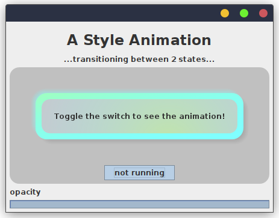

# Animations and View Models #

Animations can become rather complicated. They may consist of multiple
stages as well as multiple elements that are animated at the same time.
All of this requires a lot of state management, which describes what the 
animation looks like at any given point in time and how it should change. <br>
When doing clean application design however, we want to separate
the looks of the application from the state and logic. <br>
So the way an application is presented to the user is defined by the *view*
and the views state and logic is defined by the *view model*.
This distinction should also be made when it comes to animations. 

But this is where writing them become a bit tricky because we have to
define the animation state and its update logic in the view model
and how this state should be continuously displayed in the view. <br>

In this guide we will show you the recommended way to write 
clean and robust animations in your application.

## Modelling Animations ##

For very advanced kind of animations you may want to define
dedicated model classes for your animations which are then
part of your view model. <br>
But most animations typically consist of only one or two
properties that are animated. In this guide we will examine a simple example
where we animate the opacity and border color of a view.

Take a look at following record based view model first.

```java
public record ModelledAnimationViewModel(
    String buttonText, Stride animationStride, double borderWidth, double borderOpacity
) {
    public Animatable<ModelledAnimationViewModel> borderAnimation() {
        return Animatable.of(LifeTime.of(3, TimeUnit.SECONDS), this, (status, model) -> {
            boolean isRunning = status.progress() % 1 != 0;
            double localProgress = this.animationStride.applyTo(status.progress());
            Stride nextStride = status.progress() == 1 ? this.animationStride.inverse() : this.animationStride;
            return withNewAnimationState( 
                        isRunning ? "running" : "not running", 
                        nextStride, 
                        localProgress * 10,
                        localProgress 
                    );
        });
    }
    
    public ModelledAnimationViewModel withNewAnimationState(
            String buttonText, Stride animationStride, double borderWidth, double borderOpacity
    ) {
        return new ModelledAnimationViewModel(buttonText, animationStride, borderWidth, borderOpacity);
    }
}
```

Above we model the state of a basic view as well as its animation. <br>
The interesting part in the above model is the `borderAnimation` method which returns an `Animatable` object. <br>
This object defines what it means to animate the `ModelledAnimationViewModel` class in
the form of a lambda function taking in the current `AnimationStatus` and model instance
as well as an initial model instance from which the animation should start. <br>
So it is primarily a wrapper for a pure function that is continuously called by the view
to update the model instance. <br>
The `Animatable` also stores the `LifeTime` of the animation,
which is used by the view to determine when the animation should start and stop. <br>

Now let's take a look at the view that uses this view model:

```java

import sprouts.Val;
import sprouts.Var;
import swingtree.UI;
import swingtree.animation.Stride;

import static swingtree.UI.*;

public class ModelledAnimationView extends Panel
{
    public ModelledAnimationView(Var<ModelledAnimationViewModel> vm) {
        Val<String> buttonText = vm.viewAsString(ModelledAnimationViewModel::buttonText);
        Val<Double> borderWidth = vm.viewAsDouble(ModelledAnimationViewModel::borderWidth);
        Val<Double> borderOpacity = vm.viewAsDouble(ModelledAnimationViewModel::borderOpacity);
        UI.of(this).withLayout(WRAP(1), "[grow]", "[grow]")
        .add(CENTER,
            html("<h1 style=\"text-align: center;\">A Style Animation</h1>" +
                    "<p>...transitioning between 2 states...</p>")
        )
        .add(GROW,
            panel(FILL.and(WRAP(1))).withStyle(it->it.borderRadius(32).backgroundColor(Color.LIGHT_GRAY))
            .add(CENTER,
                box().add(
                    label("Toggle the switch to see the animation!")
                    .withRepaintOn(borderOpacity, borderWidth)
                    .withStyle( it -> it
                        .padding(26 - vm.get().borderWidth()/2)
                        .margin(42 - vm.get().borderWidth()/2)
                        .borderRadius( 38 )
                        .border(vm.get().borderWidth(), color(0.5,1,1, vm.get().borderOpacity()))
                        .backgroundColor(200/255d, 210/255d, 220/255d, 0.5 )
                        .shadow("bright", s -> s.color(0.5, 1, 1, 0.5).offset(-6) )
                        .shadow("dark", s -> s.color(0, 0, 0, 0.5/4).offset(+6) )
                        .shadowBlurRadius(5)
                        .shadowSpreadRadius(-2.5)
                        .shadowIsInset(false)
                        .gradient(Layer.BORDER, "border-gradient", grad -> grad
                            .span(Span.TOP_LEFT_TO_BOTTOM_RIGHT)
                            .colors( color(0.75, 1, 0.5, 0.5), color(0.5, 1, 1, 0) )
                            .clipTo(ComponentArea.BORDER)
                        )
                        .gradient(Layer.BACKGROUND, "content-gradient", grad -> grad
                            .type(GradientType.RADIAL)
                            .boundary(ComponentBoundary.BORDER_TO_INTERIOR)
                            .offset(
                                it.component().getWidth()*0.5,
                                it.component().getHeight()*0.5
                            )
                            .colors( color(0.75, 1, 0.5, 0.5), color(0.5, 1, 1, 0) )
                            .clipTo(ComponentArea.BODY)
                            .size(225)
                        )
                    )
                )
            )
            .add(CENTER,
                toggleButton(buttonText)
                .onClick( e -> 
                    UI.animate(vm, ModelledAnimationViewModel::borderAnimation)
                )
            )
        )
        .add(GROW_X, label("opacity"))
        .add(GROW_X, progressBar(Align.HORIZONTAL, borderOpacity));
    }

    public static void main(String[] args) {
        Var<ModelledAnimationViewModel> vm = Var.of(new ModelledAnimationViewModel("Toggle Me", Stride.PROGRESSIVE, 0, 0));
        UI.show( f -> new ModelledAnimationView(vm) );
    }
}
```

The view is a simple panel with a toggle button, progress bar
and most importantly a heavily styled and animated label. <br>

It should look like this when running `ModelledAnimationView.main`:




In the source code of the view 
there are 4 important things to focus on
to understand how the animation works:

1. In the beginning we zoom to individual properties of the view model
   using the `viewAs...` methods. These properties are then used 
   to define the label text and its style.
2. We use `withRepaintOn` to tell the view to repaint the label
   whenever the border width or opacity changes. This is important
   because the view model is updated continuously by the animation
   and the view needs to reflect these changes.
3. The label is styled using the `withStyle` method. This method
   takes a lambda function that defines the style of the label,
   in our case the border width and opacity. 
   The lambda function is called every time the view is repainted.
   This is important because so that it can use the current
   state of the view model to determine the style of the label.
4. And finally the place where the animation is triggered is the
   `onClick` method of the toggle button, which calls the expression
   `UI.animate(vm, ModelledAnimationViewModel::borderAnimation)`.
   This expression takes the `Animatable` object from the view model
   as well as the `vm` variable holding the mutable view model state
   and starts the animation by continuously invoking the `Animatable`
   object's lambda function and using its result to update the `vm` variable.

