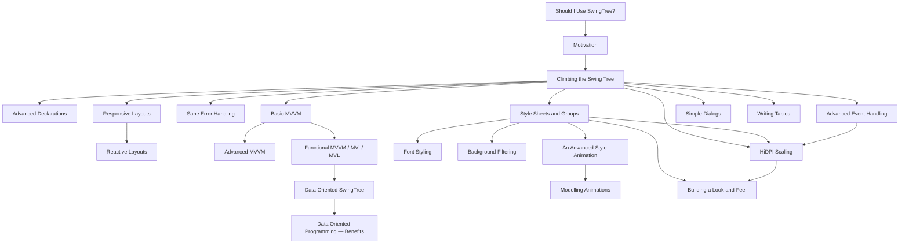

# 📚 The SwingTree Wiki #

Welcome to the SwingTree wiki — a handful of focused guides that, taken
together, cover every major piece of the SwingTree API. Still deciding whether
the library is right for you? Start with
[**Should I Use SwingTree?**](./Should-I-Use-SwingTree.md). Otherwise, if this is
your first stop, start with [**Motivation**](./Motivation.md) and then
[**Climbing the Swing Tree**](./Climbing-Swing-Tree.md). Everything else
fans out from there.

> 🤖 **Using an AI coding agent?** Drop
> [`../agent-skills/SKILL.md`](../agent-skills/SKILL.md) into its context — a
> single self-contained file that teaches the agent the whole SwingTree API,
> the MVI/MVL & MVVM patterns, styling, animation, and the common pitfalls, so
> it writes idiomatic SwingTree from the start.

---

## 🌱 Start here ##

| Guide | What you'll learn |
|---|---|
| [Should I Use SwingTree?](./Should-I-Use-SwingTree.md) | An honest decision guide — when SwingTree is a great fit, when it isn't, and how it compares to Compose, React, Vue & friends. |
| [Motivation](./Motivation.md) | *Why* SwingTree exists and what problem declarative UI code solves. |
| [Climbing the Swing Tree](./Climbing-Swing-Tree.md) | The end-to-end primer: declarations, layouts, properties, events, styling, animations. |
| [Advanced Declarations](./Advanced-Declarations.md) | The escape hatches `peek`, `apply`, `applyIf`, `applyIfPresent`, and `UI.of(..)` for custom components. |
| [Sane Error Handling](./Sane-Error-Handling.md) | How SwingTree contains exceptions thrown inside your declarations so the rest of the UI still renders. |

## 🧩 Architecture — Model, View, & friends ##

| Guide | When to reach for it |
|---|---|
| [Basic MVVM](./Basic-MVVM.md) | A gentle introduction to property-based MVVM with mutable `Var`s. |
| [Advanced MVVM](./Advanced-MVVM.md) | Sub-view models, observable lists, polymorphic views — still the classical mutable flavor. |
| [Functional MVVM (MVI / MVL)](./Functional-MVVM.md) | **Recommended for new code.** Immutable record-based view models + `Var.zoomTo(..)` lenses. |
| [Data Oriented SwingTree](./Data-Oriented-SwingTree.md) | The theory behind MVI / MVL: value semantics, lenses, tuples, structural sharing. |
| [Data Oriented Programming — Benefits](./Data-Oriented-Programming-Benefits.md) | The pragmatic payoff: testability, concurrency, memory locality, undo/redo. |
| [Advanced Event Handling](./Advanced-Event-Handling.md) | Wiring custom `Observable`s to the UI with `on(..)` (app thread) and `onView(..)` (EDT). |

## 📐 Layout — static, responsive, reactive ##

| Guide | What it covers |
|---|---|
| [Responsive Layouts](./Responsive-Layouts.md) | The `ResponsiveGridFlowLayout` and the 12-column `AUTO_SPAN` model — adapt as the container resizes. |
| [Reactive Layouts](./Reactive-Layouts.md) | Bind the **entire layout** to a `Var<Layout>` property. Swap MigLayout / flow / box at runtime, atomically. |

## 🎨 Styling & animation ##

| Guide | What it covers |
|---|---|
| [Style Sheets and Groups](./Style-Sheets-And-Groups.md) | The CSS-like central style sheet, semantic `group()` tags, and hot-swappable themes (the [Theme Garden](../../src/test/java/examples/zen/ThemeGardenView.java) example). |
| [Font Styling](./Font-Styling.md) | Gradient and noise paints on text via the `componentFont(..)` sub-style. |
| [Background Filtering](./Background-Filtering.md) | Frosted-glass effects via the `parentFilter(..)` sub-style. |
| [An Advanced Style Animation](./An-Advanced-Style-Animation.md) | The `withTransitionalStyle(..)` API for smoothly transitioning between two styled states. |
| [Modelling Animations](./Modelling-Animations.md) | Putting animation state into the view model and re-arming animations from a single source of truth. |

## 🪟 Common components ##

| Guide | What it covers |
|---|---|
| [Simple Dialogs](./Simple-Dialogs.md) | `UI.confirmation(..)` / `UI.message(..)` — the SwingTree wrappers around `JOptionPane`. |
| [Writing Tables](./Writing-Tables.md) | Declarative `JTable` models, editable cells, and custom cell renderers. |

## 🔍 Under the hood ##

| Guide | What it covers |
|---|---|
| [HiDPI Scaling](./HiDPI-Scaling.md) | "Developer pixels" vs "component pixels", how SwingTree scales inputs up and outputs down for you, the scaling-aware delegate accessors, and the double-scaling trap behind the deprecated `component()`. |
| [Building a Look-and-Feel](./Building-A-Look-And-Feel.md) | An onramp for advanced users who want to ship a custom `LookAndFeel` backed by the SwingTree style engine — the `SwingTreeStyledComponentUI` contract, the three styling layers, and what the engine handles for you vs. what you implement. |

---

## 🗺️ A reading path ##

If you want a recommended order in which to read the guides:

## 🧪 Worth keeping open while reading ##

Most guides reference live, runnable examples in
[`src/test/java/examples`](../../src/test/java/examples). The most
illustrative ones:

- [**ThemeGardenView**](../../src/test/java/examples/zen/ThemeGardenView.java) — one skeleton UI, five completely different themes, switchable at runtime. See [Style Sheets and Groups](./Style-Sheets-And-Groups.md).
- [**BreathingView**](../../src/test/java/examples/breathing/mvi/BreathingView.java) — a glowing breathing-companion app, every frame derived from an immutable view model. See [Modelling Animations](./Modelling-Animations.md).
- [**CelestialScribe**](../../src/test/java/examples/scribe/CelestialScribe.java) — text flowing around draggable stars, layout entirely derived from a `Tuple<Star>`. See [Reactive Layouts](./Reactive-Layouts.md).
- [**SalesDashboard**](../../src/test/java/examples/dashboard/SalesDashboard.java) — a single dashboard reflowed by toggling a `Var<Layout>`. See [Reactive Layouts](./Reactive-Layouts.md).
- [**CalculatorView**](../../src/test/java/examples/calculator/mvi/CalculatorView.java) — the canonical MVI / MVL walk-through. See [Functional MVVM](./Functional-MVVM.md).
- [**TeamView**](../../src/test/java/examples/team/mvi/TeamView.java) (MVI / MVL) and its [classical MVVM twin](../../src/test/java/examples/team/mvvm/TeamView.java) — the *same* People Directory UI implemented in both architectures, side by side. The clearest way to feel the contrast between immutable-record + lenses and mutable `Var`-fields. See [Advanced MVVM](./Advanced-MVVM.md) and [Functional MVVM](./Functional-MVVM.md).