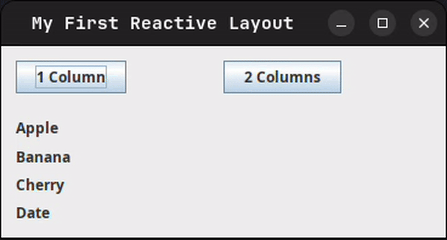
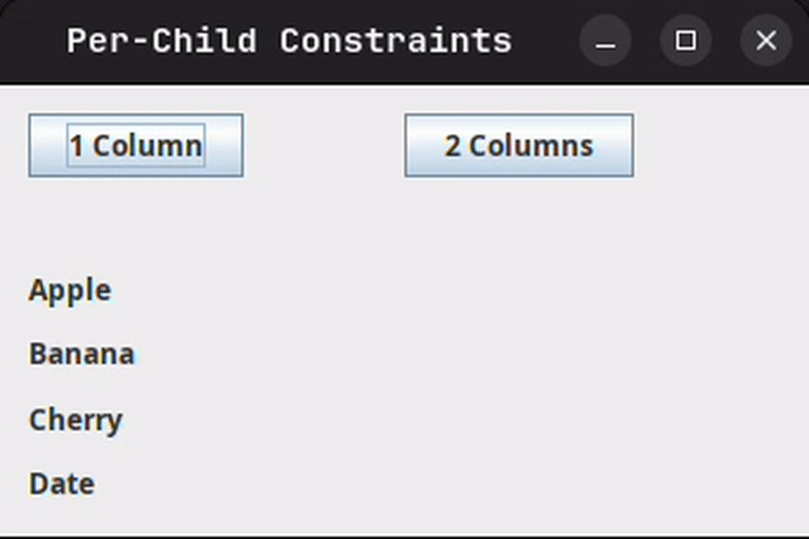
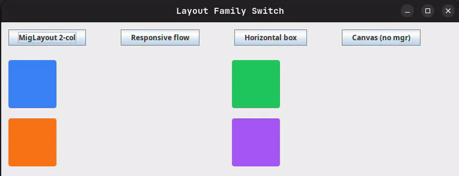
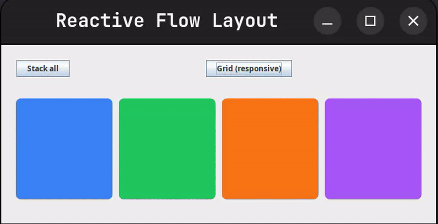

# Reactive Layouts #

> **Prerequisites:** This guide assumes you are comfortable with the basics
> covered in [Climbing the Swing Tree](./Climbing-Swing-Tree.md)
> and with the responsive flow layout introduced in
> [Responsive Layouts](./Responsive-Layouts.md).
>
> You will also benefit from a passing familiarity with the
> [property system](./Functional-MVVM.md) (`Var` / `Val`),
> though the examples here are self-contained.

The [Responsive Layouts](./Responsive-Layouts.md) guide showed you how to write a
layout that adjusts automatically as the **window is resized**. That covers one
important dimension of adaptability — but what if you need the layout to change in
response to something entirely different?

- A user clicks "Compact view" in the toolbar.
- The application switches from edit mode to read mode.
- A data model changes from a single item to a list.
- An authenticated user gets a wider, more information-dense layout than a guest.

For all of these scenarios you want the same thing: the ability to **swap the layout
at runtime** without destroying and rebuilding every component on screen.
That is exactly what SwingTree's **reactive layout** system gives you.

---

## The Key Idea ##

In a standard SwingTree UI, a panel's layout manager is chosen once when the
component is constructed and then stays fixed forever. Changing it later requires
you to call `setLayout(...)` imperatively, then `revalidate()`, then `repaint()` —
tedious bookkeeping that is easy to forget and hard to test.

SwingTree's reactive layout system replaces all of that with **one property**:

```java
Var<Layout> layout = Var.of(Layout.class, Layout.mig("fill, wrap 1"));
```

Bind a panel to this property once, and every future `layout.set(newLayout)` call
will update the layout manager automatically — in-place where possible, or by
replacing it otherwise — and trigger the necessary repaint, all without any
additional code on your part.

The panel binding is done through `withLayout(Val<Layout>)`, or its shorthand
factory `UI.panel(layout)`:

```java
// Long form — bind after creating the panel
UI.panel().withLayout(layout)

// Short form — factory handles the binding for you
UI.panel(layout)
```

Both are equivalent. Use whichever reads more clearly in context.

---

## Your First Reactive Panel ##

Here is the minimal example: a toolbar with two buttons that toggle a list of
items between a single-column and a two-column arrangement.

```java
import static swingtree.UI.*;
import sprouts.Var;
import swingtree.api.Layout;

public static void main(String[] args) {

    Var<Layout> layout = Var.of(Layout.class, Layout.mig("fill, wrap 1"));

    UI.show("My First Reactive Layout", frame ->
        panel("fill, wrap 1")
        .add("growx, top",
            panel("fillx, insets 6")
            .add(button("1 Column" ).onClick(e -> layout.set(Layout.mig("fill, wrap 1"))))
            .add(button("2 Columns").onClick(e -> layout.set(Layout.mig("fill, wrap 2"))))
        )
        .add("grow",
            panel(layout)
            .add("growx", label("Apple" ))
            .add("growx", label("Banana"))
            .add("growx", label("Cherry"))
            .add("growx", label("Date"  ))
        )
        .get(javax.swing.JPanel.class)
    );
}
```

Run this, click "2 Columns", and the four labels instantly rearrange into a 2×2
grid. Click "1 Column" and they stack back up. The labels are never destroyed or
recreated; only the layout rule changes.



> **How it works under the hood**
>
> When you call `withLayout(Val<Layout>)`, SwingTree subscribes to the property on
> your behalf. Every time the property fires a change event, the style engine
> re-evaluates the style function `it -> it.layout(layout.get())` and calls
> `Layout.installFor(panel)` on the result.
>
> For `Layout.mig(...)` switching between two wrap counts, SwingTree recognises
> that the same `MigLayout` type is already installed and updates its constraint
> **in-place** on the existing instance. No new layout manager is created; no
> component subtree is invalidated unnecessarily.

---

## Adding Per-Child Constraints ##

Changing the wrap count is already useful, but real-world layouts often need
individual widgets to span multiple columns. For example, in tablet view you might
want the top four cards in a 2×2 grid, while the two larger detail panels each
stretch across the full width.

SwingTree lets you attach **per-child add-constraints** directly to the `Layout`
object itself, using `withChildConstraints(MigAddConstraint...)`.
Entries are mapped to children **positionally** — index 0 applies to the first
child, index 1 to the second, and so on.

```java
import swingtree.layout.MigAddConstraint;

// Every child fills its own row
private static Layout oneColumnLayout() {
    return Layout.mig("fill, wrap 1").withChildConstraints(
        MigAddConstraint.of("growx"),  // Apple
        MigAddConstraint.of("growx"),  // Banana
        MigAddConstraint.of("growx"),  // Cherry
        MigAddConstraint.of("growx")   // Date
    );
}

// Top two items side-by-side; bottom two each span the full width
private static Layout twoColumnLayout() {
    return Layout.mig("fill, wrap 2").withChildConstraints(
        MigAddConstraint.of("growx"),         // Apple  — left cell
        MigAddConstraint.of("growx"),         // Banana — right cell
        MigAddConstraint.of("growx, span 2"), // Cherry — spans both columns
        MigAddConstraint.of("growx, span 2")  // Date   — spans both columns
    );
}
```

Wire them up exactly as before:

```java
Var<Layout> layout = Var.of(Layout.class, twoColumnLayout());

UI.show("Per-Child Constraints", frame ->
    panel("fill, wrap 1")
    .add("growx, top",
        panel("fillx, insets 6")
        .add(button("1 Column" ).onClick(e -> layout.set(oneColumnLayout())))
        .add(button("2 Columns").onClick(e -> layout.set(twoColumnLayout())))
    )
    .add("grow",
        panel(layout)
        .add("growx", label("Apple" ))
        .add("growx", label("Banana"))
        .add("growx", label("Cherry"))
        .add("growx", label("Date"  ))
    )
    .get(javax.swing.JPanel.class)
);
```

A single `layout.set(twoColumnLayout())` atomically updates the MigLayout's wrap
count **and** the add-constraint of every child in one shot. No loop over children,
no imperative `migLayout.setComponentConstraints(child, ...)` calls.



---

## Switching Layout Families Entirely ##

`Var<Layout>` is not limited to `MigLayout`. You can switch between completely
different layout families by assigning any `Layout` implementation to the property.
SwingTree replaces the old manager with the new one automatically.

| Factory | Layout manager installed |
|---|---|
| `Layout.mig("fill, wrap 2")` | `MigLayout` with the given constraints |
| `Layout.flow()` | `ResponsiveGridFlowLayout` (see below) |
| `Layout.border()` | `java.awt.BorderLayout` |
| `Layout.grid(rows, cols)` | `java.awt.GridLayout` |
| `Layout.box(UI.Axis.X)` | `javax.swing.BoxLayout` along X axis |
| `Layout.unspecific()` | No-op — current manager is untouched |
| `Layout.none()` | Removes the manager (`setLayout(null)`) |

```java
import static swingtree.UI.*;
import sprouts.Var;
import swingtree.api.Layout;
import java.awt.Color;

public static void main(String[] args) {
    Var<Layout> layout = Var.of(Layout.class, Layout.mig("fill, wrap 2"));

    UI.show("Layout Family Switch", frame ->
        panel("fill, wrap 1")
        .add("growx, top",
            panel("fillx, insets 6")
            .add(button("MigLayout 2-col" ).onClick(e -> layout.set(Layout.mig("fill, wrap 2"))))
            .add(button("Responsive flow" ).onClick(e -> layout.set(Layout.flow())))
            .add(button("Horizontal box"  ).onClick(e -> layout.set(Layout.box(UI.Axis.X))))
            .add(button("Canvas (no mgr)" ).onClick(e -> layout.set(Layout.none())))
        )
        .add("grow",
            panel(layout)
            .withPrefSize(400, 200)
            .add(box().withPrefSize(80, 80).withStyle(it -> it.backgroundColor(new Color( 59,130,246)).borderRadius(8)))
            .add(box().withPrefSize(80, 80).withStyle(it -> it.backgroundColor(new Color( 34,197, 94)).borderRadius(8)))
            .add(box().withPrefSize(80, 80).withStyle(it -> it.backgroundColor(new Color(249,115, 22)).borderRadius(8)))
            .add(box().withPrefSize(80, 80).withStyle(it -> it.backgroundColor(new Color(168, 85,247)).borderRadius(8)))
        )
        .get(javax.swing.JPanel.class)
    );
}
```

A few things worth noting about the special sentinels:

**`Layout.unspecific()`** is a deliberate no-op. When `installFor` is called on it,
it does nothing at all — whatever layout manager is currently on the component stays
untouched. This is handy as a neutral "don't care" starting value while your
application state is still resolving, or as a way to express "inherit from parent".

**`Layout.none()`** calls `setLayout(null)`, which removes the layout manager
entirely and hands you absolute positioning. Children stay where they are; from that
point on you position them by setting their bounds manually. Switching back to a
concrete layout is as simple as setting the property again — the new manager is
immediately installed.



---

## Reactive + Responsive: `Layout.flow()` with `AUTO_SPAN` ##

The `ResponsiveGridFlowLayout` introduced in
[Responsive Layouts](./Responsive-Layouts.md) already gives you size-category-based
adaptation *as the container is resized*. You can take this one step further by
making the per-child span policies themselves reactive: change them wholesale via
`Var<Layout>`, and all children are updated atomically.

Each child gets a `FlowCell` — created by `AUTO_SPAN(...)` — that describes how
many of the 12 virtual columns it should occupy at each size category. Pass these to
`Layout.flow(FlowCell...)` as positional constraints:

```java
import static swingtree.UI.*;
import sprouts.Var;
import swingtree.api.Layout;
import swingtree.layout.FlowCell;
import java.awt.Color;

// All four items fill the full row — a "stacked" mobile look
private static Layout stackedFlow() {
    FlowCell full = AUTO_SPAN(it -> it.small(12).medium(12).large(12));
    return Layout.flow(full, full, full, full);
}

// Two per row at medium, four per row at large — a "grid" look
private static Layout gridFlow() {
    FlowCell twoOrFour = AUTO_SPAN(it -> it.small(12).medium(6).large(3));
    return Layout.flow(twoOrFour, twoOrFour, twoOrFour, twoOrFour);
}

public static void main(String[] args) {
    // Start with the plain flow layout (no per-child constraints yet)
    // so the build-time installFor doesn't run on an empty panel.
    Var<Layout> layout = Var.of(Layout.class, Layout.flow());
    
    UI.show("Reactive Flow Layout", frame ->
        panel("fill, wrap 1")
        .add("growx, top",
            panel("fillx, insets 6")
            .add(button("Stack all"        ).onClick(e -> layout.set(stackedFlow())))
            .add(button("Grid (responsive)").onClick(e -> layout.set(gridFlow())))
        )
        .add("grow", 
            panel(layout)
            .withPrefSize(500, 200)
            .add(box().withPrefSize(100, 80).withStyle(it -> it.backgroundColor(new Color( 59,130,246)).borderRadius(8)))
            .add(box().withPrefSize(100, 80).withStyle(it -> it.backgroundColor(new Color( 34,197, 94)).borderRadius(8)))
            .add(box().withPrefSize(100, 80).withStyle(it -> it.backgroundColor(new Color(249,115, 22)).borderRadius(8)))
            .add(box().withPrefSize(100, 80).withStyle(it -> it.backgroundColor(new Color(168, 85,247)).borderRadius(8)))
        )
        .get(javax.swing.JPanel.class)
    );
}
```



Once the `FlowCell` constraints are set you still get the window-resize adaptation
for free — the responsive size categories (`small`, `medium`, `large`, …) respond
to the container's current width vs. preferred width, exactly as described in the
[Responsive Layouts](./Responsive-Layouts.md) guide.

---

## A Real-World Example: The Sales Dashboard ##

All of the above comes together in the
[`SalesDashboard`](../../src/test/java/examples/dashboard/SalesDashboard.java)
example included in the test suite.

Feel free to explore the code and run it yourself.

---

## Conclusion ##

Reactive layouts turn a one-time construction decision into a first-class piece of
application state. By binding a panel's layout manager to a `Var<Layout>` property,
you get:

- **No component rebuilding** — children stay alive and retain all their bound
  properties; only the arrangement rules change.
- **Atomic updates** — both the grid constraint and every child's individual span
  are changed in a single `Var.set(...)` call.
- **Testability** — layout logic is pure, immutable data (`Layout` objects) that
  can be inspected, compared and verified without running a GUI.
- **Composability** — because reactive layouts use the exact same `Var`/`Val`
  property system as everything else in SwingTree, they combine naturally with
  reactive text, reactive styles, reactive visibility, and animations.

For the full working example explore
[SalesDashboard.java](../../src/test/java/examples/dashboard/SalesDashboard.java),
and if you want to go deeper into designing large reactive view models check out
[Functional MVVM](./Functional-MVVM.md).