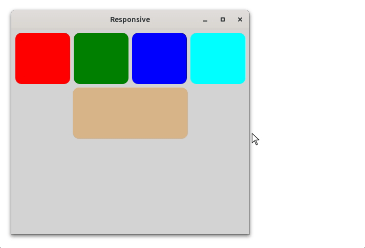

# Responsive Layouts #

An important aspect of modern UI design is to make your UI layout responsive
to different screen sizes and resolutions. The state of the art in web design
is to use CSS Grids to create responsive layouts.

SwingTree offers a similar approach to building responsive 
layouts for Swing components through the `ResponsiveGridFlowLayout` class,
which is heavily inspired by the [12 columns based grid layout from bootstrap](https://getbootstrap.com/docs/4.0/layout/grid/).

In this guide we will show you how to make your SwingTree UI declarations
responsive to different screen and parent container sizes.

## Width Classification ##

The basic idea behind any responsive layout is to define a set of relative size categories
that a container component can be in (either in terms of width or height),
and then based on this category place the child components so that they
fit the available space in the best way possible.

A popular approach to have simple "small", "medium", "large" and "very large" categories
and then use these categories to define how many columns a component should span in a grid layout.

This is the approach that SwingTree takes with the `ResponsiveGridFlowLayout` class.

So a component wrapper, like a `JPanel` with a SwingTree based flow layout
takes in components with custom span configurations for each size category.
These span configurations define how many columns/cells should be spanned.

This size category is based on the width of the parent compared to its preferred width.
So a component is considered large if it meets its preferred size.
And it is considered smaller if it is closer to 0.
(A size larger than the preferred width is considered "oversize", which is also a valid category)

## Example ##

Enough theory, let's see how this works in practice!

```java
public static void main(String[] args) {
    UI.show("Responsive", f ->
        UI.panel().withFlowLayout(UI.HorizontalAlignment.CENTER, 7,7)
        .withPrefSize(500, 400)
        .withBackground(UI.Color.LIGHTGRAY)
        .add(UI.AUTO_SPAN(it->it.small(12).medium(4).large(3).veryLarge(3)),
             UI.box().withPrefSize(100,100).withStyle(it->it
                 .backgroundColor(UI.Color.RED).borderRadius(24)
             )
        )
        .add(UI.AUTO_SPAN( it -> it.small(3).medium(4).large(3).veryLarge(3).oversize(12)),
             UI.box().withPrefSize(100,100).withStyle(it->it
                 .backgroundColor(UI.Color.GREEN).borderRadius(24)
             )
        )
        .add(UI.AUTO_SPAN(it->it.small(3).medium(4).large(3)),
             UI.box().withPrefSize(100,100).withStyle(it->it
                 .backgroundColor(UI.Color.BLUE).borderRadius(24)
             )
        )
        .add(UI.AUTO_SPAN(it->it.small(3).medium(4).large(3)),
             UI.box().withPrefSize(100,100).withStyle(it->it
                 .backgroundColor(UI.Color.CYAN).borderRadius(24)
             )
        )
        .add(UI.AUTO_SPAN(it->it.small(12).medium(4).large(6)),
             UI.box().withPrefSize(100,100).withStyle(it->it
                 .backgroundColor(UI.Color.OAK).borderRadius(24)
             )
        )
        .get(javax.swing.JPanel.class)
    );
} 
```



This code creates a responsive layout consisting of 5 boxes,
which are laid out in vastly different ways depending on the size of the parent panel.
The most important part here is the `UI.AUTO_SPAN(..)` method calls, which
produce `FlowCell` objects that define the span configuration for each size category.
Without these component constraints, the layout would behave exactly like a normal flow layout.

Note that we are not explicitly creating a `ResponsiveGridFlowLayout` object.
This is done automatically by the `withFlowLayout(..)` method, which instantiates
and installs the layout manager for you.

The configurator lambda passed to the `UI.AUTO_SPAN(..)` method is 
not only a fluent API for setting the span configuration, but also
a way to determine these span configurations dynamically.
What this means is that every time the parent component is resized,
the layout manager will re-evaluate these lambda expressions and
re-layout the components accordingly.

This is a powerful feature that allows you to create dynamic layouts
that adapt to any conceivable screen size or parent container size.

## Conclusion ##

SwingTree's `ResponsiveGridFlowLayout` is a nice alternative to
the rather complex `MigLayout` and `GridBagLayout` classes that
are often used for creating responsive layouts in Swing applications.

By utilizing the concept of size categories and span configurations, 
SwingTree optimizes the trade-off between flexibility and ease of use
to allow you to design UIs that look great and function well on a wide range 
of screen sizes and devices.
