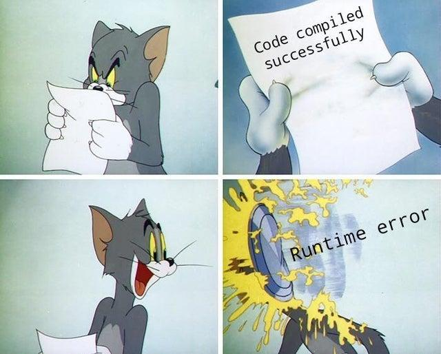

# Runtime Errors in GUI Code #




Errors are a normal part of every system, and
as such it is extremely important for any particular system to
handle them well.
Unfortunately however, there is no single method of handling errors
which is appropriate for all situations.
Different code parts of different domains require
their own unique error handling strategies.

This is also true for GUI code, which has one very
important requirement: **The show must go on!**

Which is to say, that when an error occurs in GUI assembling code,
then the exception should be caught and logged as
soon as possible so that the rest of the GUI components can
be assembled and displayed to the user as intended.

A fair analogy to this is how in a real life theater,
if an actor forgets a line in the middle of a play,
then the other actors will improvise and continue the play
as if nothing happened.

This is also how a web browser handles errors in HTML code.
It does not stop rendering the page,
but instead displays the page to the best of its ability
and logs the error to the console.

Consider the following example of a plain Swing class:

```java
class MySettings extends JPanel {
    public MySettings(MySettingsViewModel vm) {
        super(new MigLayout("fillx, wrap 2, insets 0"));
        setBackground(vm.isDarkMode() ? Color.BLACK : Color.WHITE);
        add(new JLabel("Configure:"), "span 2");
        for ( String setting : vm.getSettings() ) {
            add(new JLabel(setting));
            add(new JTextField(vm.getValue(setting)));
        }
    }
}
```

Here we use procedural code to assemble a GUI using a handful of components.
The problem with this code is that it is not at all exception safe.
So if any of the involved method calls, like for example the `vm.getValue(String)` method, 
throws an exception, then not only will it prevent the current `JPanel` from 
being created, but it will also
bubble up to the caller of the constructor which itself may also
be unable to handle the exception to a crippling degree... and so on.

You can see how in a larger desktop application, consisting of many
different GUI components, this can quickly become a severe problem, as
only a single little error can bring down the entire application.
Most likely, merely a pointless little `NullPointerException`... :facepalm:

## SwingTree to the Rescue ##

Unfortunately SwingTree can not fix this problem entirely, as this is
to a large degree an innate and desired property of procedural code, 
however it does mitigate this issue largely by catching and logging all exceptions
occurring in those procedural parts of your GUI code which
are captured and embedded in your SwingTree declarations.

Here, take a look at the example below which is written using SwingTree:

```java
import swingtree.UI;

class MySettings extends JPanel {
    public MySettings(MySettingsViewModel vm) {
        UI.of(this).withLayout("fillx, wrap 2, insets 0")
        .peek( p -> {
            p.setBackground(vm.isDarkMode() ? Color.BLACK : Color.WHITE);
        })
        .add("span 2", UI.label("Configure:"))
        .apply( ui -> {
            for (String setting : vm.getSettings())
                ui.add(
                    UI.label(setting),
                    UI.textField(vm.getValue(setting))
                );
        });
    }
}
```

Note that contrary to the previous example,
the SwingTree version of the code captures some of
the procedural code in lambda expressions, namely the
exception safe `peek` and `apply` methods.
The `peek` method exposes the `JPanel` instance to the lambda
expression, while the `apply` method exposes the wrapping builder node
to the lambda expression.
When either one of these methods executes their lambda expression
and an exception occurs within, then the exception is caught and logged
to the `Slf4j` API, which in turn can be configured to log to
any logging framework of your choice.

**What this means is that even if a strange user torments the code paths
of your application with all kinds of weird inputs, then you can be
assured that the non-affected GUI components will still be assembled and displayed
to the user as intended.**
