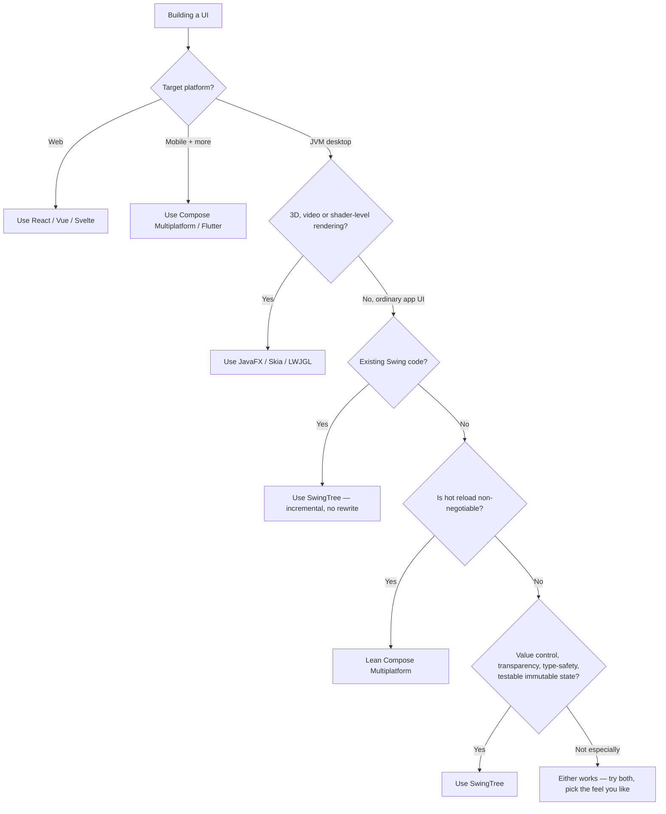

# Should I Use SwingTree? #

> **TL;DR** — If you are building a **desktop application on the JVM** and you
> value **control, transparency and debuggability** as much as a modern,
> declarative developer experience, SwingTree is very likely a great fit.
> If you need mobile or web, or your iteration loop depends on hot reload and
> live design previews, it is honestly not the tool for you — and we'll point you
> at the right one below.
>
> One thing that is **not** on that second list: rendering performance. Heavily
> styled, animated, live-resized SwingTree UIs are smooth, because the style
> engine caches what it draws instead of redrawing it — see
> [Snappy Rendering](./Snappy-Rendering.md).

This page exists to help you make that call *quickly and honestly*, before you
invest a day reading the rest of the [wiki](./README.md). We are not going to
pretend SwingTree is the best choice for every project — no library is. Instead
we'll tell you exactly what SwingTree is, what it is **not**, and how it stacks up
against the frameworks you are probably also considering.

---

## The 30-second answer ##

Answer these and you'll know:

| Question | If "yes" → |
|---|---|
| Are you targeting **desktop** (Windows / macOS / Linux), on the **JVM**? | ✅ SwingTree is in scope. |
| Do you have an **existing Swing codebase** you want to modernize *incrementally* (no rewrite)? | ✅✅ SwingTree is almost certainly your best option. |
| Do you value being able to **set a breakpoint anywhere**, read a real stack trace, and understand every line — over framework "magic"? | ✅✅ This is exactly what we optimize for. |
| Do you want **immutable, testable application state** decoupled from the UI? | ✅✅ See [MVI / MVL](./Functional-MVVM.md) and [Data-Oriented SwingTree](./Data-Oriented-SwingTree.md). |
| Do you want a **heavily styled, animated, resizable** UI — shadows, gradients, themes — that still feels smooth? | ✅ That is what the [render cache](./Snappy-Rendering.md) is for, and it is on by default. |
| Do you need to ship to **mobile or the web** from the same codebase? | ❌ Use Compose Multiplatform, Flutter, or a web stack. |
| Do you need **hot reload or live design previews** in your edit-run loop? | ❌ Compose / web tooling will make you happier. |
| Do you need **shader-level rendering** — 3D, video, per-pixel GPU effects? | ❌ That is below Swing's floor; reach for Skia, LWJGL or JavaFX. |
| Is a **huge third-party component ecosystem** a hard requirement? | ❌ The web (React/Vue) wins that one outright. |

If you ticked the green rows, keep reading. If you ticked the red ones, we'd
genuinely rather you used the right tool — scroll to [the honest
comparison](#how-swingtree-compares).

---

## What SwingTree is — and what it deliberately isn't ##

SwingTree's goal is unapologetically specific: to be the **"Swing 2.0"** the Java
desktop world has been missing. Swing is a stable, battle-tested, truly
cross-platform GUI toolkit that quietly powers huge amounts of software (including,
famously, every JetBrains IDE). But its *API* has aged: it predates lambdas,
records, declarative UI, and modern reactive patterns. Writing Swing by hand in
the 2020s is a chore. (For the full backstory, see [Motivation](./Motivation.md).)

SwingTree fixes the *API*, not the toolkit. That single decision explains almost
everything about the library:

> [!IMPORTANT]
> **SwingTree is a library, not a runtime.** There is no virtual DOM, no
> recomposition engine, no compiler plugin, no four-backend abstraction layer.
> It is a relatively small, ordinary Java dependency that produces ordinary
> `JComponent` trees. Everything it does, you could in principle do by hand —
> it just lets you do it in a fraction of the lines.

What this means concretely:

- **It compiles to plain Swing.** Any `JComponent` you produce can be dropped into
  a hand-written Swing app, and any hand-written component can be wrapped with
  [`UI.of(..)`](./Advanced-Declarations.md#wrapping-components). Adoption is
  incremental and reversible.
- **It is not a new language or file format.** No XML, no FXML, no `.vue`, no JSX.
  Your UI is [plain Java method chaining](./Climbing-Swing-Tree.md#growing-a-stem),
  which means full compile-time type safety and full IDE support out of the box.
- **It does not own your rendering.** It paints *on top of* the installed
  Look-and-Feel (it pairs beautifully with [FlatLaf](https://www.formdev.com/flatlaf/)),
  intercepting the paint process only enough to give you
  [shadows, gradients, rounded borders and animations](./Climbing-Swing-Tree.md#blooming-flowers)
  that raw Swing can't do.

The flip side, stated plainly: because the floor is Swing, SwingTree inherits
Swing's ceiling. There is no retained scene graph and no shader access, the
theming envelope is bounded by the underlying LaF, and you live with Swing's
HiDPI/IME history (SwingTree smooths a lot of this, but it cannot rewrite AWT).

What that ceiling is *not*, despite the folklore, is a software rasterizer.
Java2D drives accelerated pipelines on every desktop platform (Direct3D or
OpenGL on Windows, Metal on macOS, XRender or OpenGL on Linux), and SwingTree's
style engine is built to stay on them: rendered styles live in GPU-resident
images and are blitted rather than redrawn. The practical limit is that
*rasterizing new antialiased geometry* is CPU work — which is exactly why the
engine goes to such lengths not to do it twice. See
[Snappy Rendering](./Snappy-Rendering.md) if you want the full picture, including
the parts SwingTree cannot fix.

---

## Why you might love it ##

### 1. Control and transparency are first-class values ###

This is the heart of SwingTree's design philosophy. Modern UI is wonderful until
something goes wrong inside a 200-thousand-line runtime you can't step into. With
SwingTree:

- **Every line is a real method call.** You can set a breakpoint on it, step into
  it, and read a stack trace that points at *your* code, not at a recomposition
  scheduler.
- **There is no hidden lifecycle.** Components are built when the builder runs,
  bound when you bind them, and updated when a property changes — that's it. No
  "why did my function run again?" recomposition puzzles.
- **Errors are contained, not catastrophic.** SwingTree wraps every lambda it
  invokes for you (`peek`, `apply`, `withStyle`, event handlers, lens functions)
  in try/catch + SLF4J logging, so one bad value renders a smaller UI instead of a
  blank window. See [Sane Error Handling](./Sane-Error-Handling.md).
- **There is an inspector.** Press `Ctrl + Shift + I` over a running window and
  you get browser-style developer tools: hold `Ctrl` and click any component to
  see its resolved style, its layout configuration, and — this is the good part —
  a **stack trace of the code that built it**, so "where does this panel come
  from?" is a click rather than an archaeology project. The same window exposes
  live library settings (UI scale, render cache mode) you can change on a running
  app.

If your instinct when evaluating a framework is *"but what is it actually doing?"*,
you are our kind of developer.

### 2. Modern apps in modern-framework line counts ###

Transparency usually costs verbosity. SwingTree's bet is that you can have most of
the conciseness of a modern declarative framework *without* the magic, because the
builder pattern + Java records + lambdas are enough. A glance at the examples makes
the point better than prose:

- [`SalesDashboard`](../../src/test/java/examples/dashboard/SalesDashboard.java) — a
  fully reflowable dashboard whose entire layout is one
  [`Var<Layout>`](./Reactive-Layouts.md).
- [`BreathingView`](../../src/test/java/examples/breathing/mvi/BreathingView.java) —
  a glowing, animated breathing companion where every frame is derived from an
  immutable view model (see [Modelling Animations](./Modelling-Animations.md)).
- [`ThemeGardenView`](../../src/test/java/examples/zen/ThemeGardenView.java) — one UI
  skeleton, five completely different themes, hot-swapped at runtime (see
  [Style Sheets and Groups](./Style-Sheets-And-Groups.md)).

None of these would be pleasant to write in hand-rolled Swing, and none of them are
long.

### 3. A genuinely excellent state-and-architecture story ###

This is, frankly, where SwingTree quietly out-classes a lot of bigger frameworks.
The recommended pattern — [MVI / MVL](./Functional-MVVM.md) — keeps your **entire
application state in immutable records** that contain *zero* references to Swing,
and reaches into them with [lens properties](./Data-Oriented-SwingTree.md)
(`Var.zoomTo(..)`). The payoff:

- Your business logic is **unit-testable without mounting a UI**.
- State is **centralized, predictable, and time-travel-friendly** (see
  [The Practical Benefits of Data Oriented Programming](./Data-Oriented-Programming-Benefits.md)).
- The same UI can be wired as classical mutable MVVM if you prefer — the
  [People Directory example exists in *both* flavors](./Advanced-MVVM.md#a-worked-example-people-directory)
  so you can compare side by side.

This is the same unidirectional, immutable-state discipline that Redux/Elm brought
to the web — but it's built into the grain here, not bolted on by convention.

### 4. It meets you where you already are ###

If you maintain a Swing application today, you do **not** have to choose between
"keep suffering" and "rewrite everything in Kotlin/Compose." You can adopt
SwingTree one panel at a time, in the language and build you already use. For most
teams in that situation, this is the deciding factor.

### 5. Heavy styling does not mean heavy frames ###

Raw Swing is an immediate-mode toolkit: nothing is retained between frames, so a
plain repaint redoes all of its work — including the expensive part, rasterizing
antialiased shadows, borders and rounded shapes. Drag a window edge and that
happens sixty times a second for inputs that never changed.

SwingTree's style engine retains that work. It renders a styled component's
expensive, stable pixels once, holds them in a display-compatible (typically
GPU-resident) image keyed by the component's immutable style description, and
blits on subsequent paints. For styles built from flat fills, borders and shadows
it goes a step further and keys them **independently of the component size**, so
a live resize re-renders nothing at all. That is why the heavily styled examples
in this repository — the chat client, the theme garden, the style studio — stay
smooth while being dragged.

The honest caveat, with numbers: in a component-dense UI under a third-party
Look-and-Feel, most of a frame is spent by *that Look-and-Feel* painting its own
borders and component bodies, which SwingTree wraps but cannot cache. In one
298-component view that was 69% of the frame, against 5–7% for the style engine's
own rendering. You can only cache what you can key, and a foreign delegate's
inputs cannot be enumerated. [Snappy Rendering](./Snappy-Rendering.md) has the
mechanisms, the measurements, and a clear statement of where the approach stops.

---

## Why you might *not* want it ##

We'd rather lose you here than have you frustrated later.

- **You need mobile or web.** SwingTree is desktop-JVM only. For "write once, run
  on Android/iOS/desktop," look at **Compose Multiplatform** or **Flutter**. For the
  browser, look at **React**, **Vue**, **Svelte**, or **Solid**.
- **Your iteration loop depends on hot reload.** **Jetpack Compose / Compose
  Multiplatform** offer `@Preview` and hot reload; SwingTree has neither, so you
  restart the app to see a change. If a sub-second edit-to-pixels loop is
  non-negotiable for you, Compose will feel better to work in. (SwingTree's answer
  is different in kind: the [dev tools](#1-control-and-transparency-are-first-class-values)
  let you change styling-relevant settings on the *running* app and click your way
  from a pixel back to the line that produced it.)
- **You need to render below Swing's floor.** Real-time 3D, video pipelines,
  per-pixel shader effects, or thousands of independently animated primitives at
  120 Hz are not what a `JComponent` tree is for. Reach for Skia, LWJGL, or
  JavaFX. Ordinary application UI — even a heavily styled and animated one — is
  a different question, and is answered in
  [Snappy Rendering](./Snappy-Rendering.md).
- **Maximum conciseness matters more than transparency.** Kotlin DSLs (Compose, the
  [JetBrains UI DSL](https://plugins.jetbrains.com/docs/intellij/kotlin-ui-dsl-version-2.html))
  and Vue's compiler-driven reactivity express the same UI in fewer characters than
  Java can. SwingTree pays a "Java tax" in punctuation; that's the cost of demanding
  no new language and no compiler plugin.
- **You depend on a vast component marketplace.** The web ecosystem is in a league
  of its own. SwingTree is a focused library, not a marketplace.
- **You're not on the JVM at all.** Then this is simply the wrong neighborhood.

There are also a few **sharp edges** that exist precisely *because* SwingTree is a
small library and not a bookkeeping runtime. They are easy to learn but worth
knowing up front: dynamic list items need a stable identity (`HasId`), some lens
subscriptions must be held by a strong reference to avoid garbage collection, and
model-driven styles should bind their property through
`withStyle(property, (item, it) -> ..)` (which is thread safe and repaints
automatically) instead of reading it inside a plain style lambda. A diffing/recomposition
engine hides all three for you — SwingTree trades that automation for the
transparency described above. (Each is documented where it matters, e.g. in
[Functional MVVM](./Functional-MVVM.md) and [Modelling Animations](./Modelling-Animations.md).)

---

## How SwingTree compares ##

A fair, opinionated summary. "Best" is per-axis; no framework wins everything.

| | SwingTree | Jetpack / Compose MP | JetBrains UI DSL | React | Vue |
|---|---|---|---|---|---|
| **Target** | JVM desktop | Android + desktop + (more) | IntelliJ plugin UIs | Web (+ RN) | Web |
| **Language** | Plain Java | Kotlin (+ compiler plugin) | Kotlin | JS/TS + JSX | JS/TS + SFC |
| **Reactivity model** | Fine-grained signals + immutable lenses | Snapshot recomposition | Bindings | VDOM re-render | Fine-grained proxies |
| **Runtime weight** | **Tiny library** | Large runtime + compiler | Small (Swing-based) | Library + VDOM | Library + reactivity |
| **Type-safe markup** | ✅ compile-checked | ✅ compile-checked | ✅ | ⚠️ partial (JSX exprs) | ⚠️ template strings |
| **Debuggability** | **Best in class** | Recomposition can be opaque | Good | VDOM indirection | Reactivity indirection |
| **Styled-UI frame cost** | Cached & blitted; free resize for flat/bordered/shadowed styles | GPU-composited (Skia) | Raw Swing painting | Browser compositor | Browser compositor |
| **Runtime inspector** | ✅ built in (`Ctrl+Shift+I`, click → source trace) | Layout Inspector (Android) | ❌ | ✅ DevTools | ✅ DevTools |
| **Hot reload / preview** | ❌ | ✅ | ❌ | ✅ | ✅ |
| **Conciseness** | Good (Java tax) | **Excellent** | Excellent (its niche) | Good | **Excellent** |
| **Incremental Swing adoption** | **✅ unique strength** | ❌ | ➖ (its own niche) | ❌ | ❌ |
| **Ecosystem / hiring** | Small | Growing | N/A | **Huge** | Large |

A few honest notes on the closest neighbors:

- **Compose Multiplatform** is the obvious modern alternative on the JVM and is
  excellent — pick it for greenfield projects that want Kotlin terseness, that
  hot-reload loop, and a single codebase reaching beyond the desktop. SwingTree's
  edge is *incremental Swing adoption*, *no new language*, and *no runtime to
  reason around*. Rendering is not the deciding axis: Compose composites on the
  GPU, SwingTree caches and blits, and both are comfortably fast enough for
  application UI. Judge them on the other rows.
- **JetBrains UI DSL** proves the builder-DSL approach works beautifully on
  Swing — but it's scoped to IDE settings panels. SwingTree is the general-purpose
  version of that idea.
- **React / Vue** are the right answer the moment "web" or "ecosystem" enters the
  requirements; they're simply solving a different problem.
- Architecturally, SwingTree's signal-and-lens reactivity is closer to **Solid /
  Svelte signals + Elm's immutable state** than to React's re-render model — useful
  to know if those mental models are familiar to you.

---

## A decision flow ##



---

## Still unsure? Just try it ##

SwingTree is a single dependency and the first window is about six lines of code —
the cheapest possible way to find out if the feel suits you:

```java
import static swingtree.UI.*;

public static void main(String[] args) {
    UI.show(
        panel("wrap 1")
        .add(label("Is SwingTree for me?"))
        .add(button("Let's find out").onClick(it -> System.out.println("Climbing the tree…")))
    );
}
```

If that felt good, the natural next steps are:

- [Climbing the Swing Tree](./Climbing-Swing-Tree.md) — the end-to-end primer.
- [Functional MVVM (MVI / MVL)](./Functional-MVVM.md) — the recommended architecture.
- [The wiki index](./README.md) — every guide, with a recommended reading path.

**And if "but is it actually smooth?" is your real question**, don't take our word
for it. Clone the repository, run one of the heavily styled examples (say
[`ThemeGardenView`](../../src/test/java/examples/zen/ThemeGardenView.java) or
[`ChatView`](../../src/test/java/examples/chat/mvi/ChatView.java)), and drag the
window edge around. Then press `Ctrl + Shift + I`, set the cache mode to
`DISABLED`, and drag it again. The difference between those two drags is the
subject of [Snappy Rendering](./Snappy-Rendering.md). There is also a
reproducible benchmark in the repo:

```bash
./gradlew runResizeBenchmark                          # one example UI
./gradlew runResizeBenchmark -Dbenchmark.view=all     # every example, as a comparison table
```

And if none of it is for you, that's fine too. We meant it about using the right
tool. 🌱
