# Snappy Rendering #

### How an immediate-mode toolkit resizes without stuttering ###

> **If you only want the knob:** render caching is **on by default** and needs no
> configuration. `SwingTree.get().setCacheMode(..)` dials it between `DISABLED` and
> `AGGRESSIVE`, and `Ctrl + Shift + I` opens dev tools where you can flip it on a
> running window. That is the whole user manual, and it lives in
> [the last section](#using-it).

In terms of rendering, Swing is an **immediate-mode** toolkit: no display list, no diffing layer, no compositor.
When a region needs updating, the components in it draw themselves into a `Graphics` from
scratch. That is wonderfully simple to reason about, and it has exactly one structural
weakness: **nothing remembers anything**. Every frame pays full price for pixels that are,
frame after frame, identical.

This article is about what SwingTree's style engine puts on top of that model to stop
paying — a cache that cannot go stale, a trick that lets a single cache entry serve every
size a component will ever have, and a handful of optimizations that are not caches at all.

---

## Where a frame goes ##

Picture a styled panel in a `JFrame`: rounded corners, flat fill, one-pixel border, soft
drop shadow. Plain Java2D does three things to put it on screen.

1. **Geometry.** Corner arcs become curve segments, the border becomes the difference
   of two rounded shapes, the shadow a stack of gradient-filled rings.
2. **An antialiased coverage mask.** For anything that isn't a pixel-aligned
   rectangle, the rasterizer computes per-pixel coverage. This is a *software* loop
   even when the destination is a GPU surface — the GPU is handed a mask, not a shape.
3. **Upload and composite.** The driver blends the paint through the mask.

Now grab the window edge and drag. Sixty times a second, all three run again.

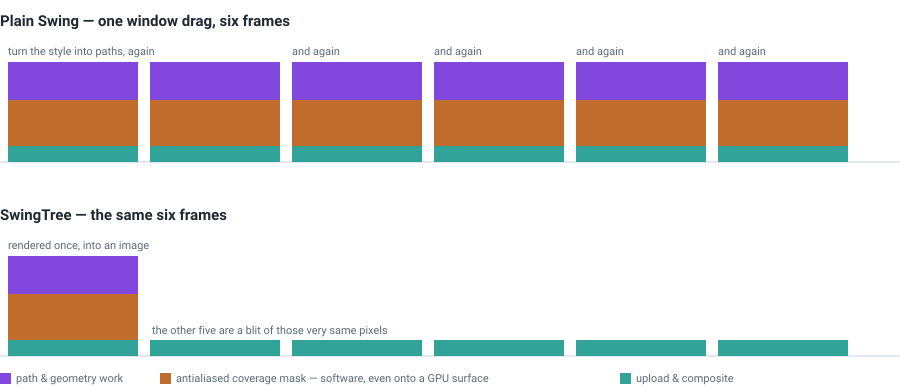

Between two frames of that drag nothing meaningful changed: same radius, same colours,
same blur. The panel got a few pixels wider, and for those few pixels we re-derived every
curve, re-rasterized every mask and re-uploaded every byte.

Which points at the whole strategy: the expensive part is *producing* pixels, not
*owning* them. Produce once, keep the result, copy it next frame. Those images are
allocated as `GraphicsConfiguration`-compatible surfaces with a high acceleration
priority, so Java2D keeps them in video memory and the copy is typically done by the GPU.

Every graphics stack arrives at that idea eventually. The interesting questions are the
ones after it:

- **What do you key the pixels on**, so you never show a stale one?
- **When are they worth the memory**, given that most will never be reused?
- **What about the one input that changes on every single frame** — the size?

Those three questions drive everything below, in that order.

---

## A cache that cannot go stale ##

Keeping a result around is the easy half. The hard half is throwing it away again at
exactly the right moment, and that is where the bugs live: something changed, nobody told
the cache, and the button on screen is still the colour it was three seconds ago.

Unless you can arrange for that sentence to be unsayable.

### The key *is* the description ###

On every paint, the style engine collects everything that describes how one component
layer looks and holds it as a single **deeply immutable value**: the box geometry
(margins, border widths, corner arcs, size), the colours, and the layer's gradients,
noises, images, texts, shadows and painters.

That value is enough to produce the rendering, deterministically. Which is precisely what
makes it a perfect cache key — so it is used as one, in a weakly held map pointing at
images of exactly that value.

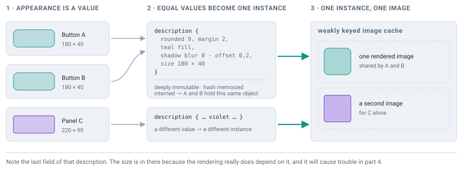

Three properties fall out of that, and together they license every heuristic later in
this article.

- **A change is a different key, not a stale entry.** Animate the corner radius and the
  next paint builds a value that isn't equal to the previous one, so the lookup misses
  and the style is rendered. Nothing had to *notice* the change — noticing isn't a step
  that exists.
- **Sharing is automatic.** Twenty toolbar buttons agreeing on style and size produce
  twenty *equal* values: one entry, one image. (Twenty buttons at twenty *different*
  sizes are the harder problem, handled [further down](#nine-slices-to-the-rescue).)
- **A miss is never a bug.** Whatever the cache doesn't have is simply drawn directly.
  So every cost heuristic here is allowed to be wrong, and loses only speed when it is.

### Canonical instances, held weakly ###

That still leaves the memory question: when does an entry go away? Eviction policies and
explicit lifetime management are both bookkeeping you can get wrong. There is a third
option:

> 1. Intern the keys into a pool of canonical instances that the pool itself holds only weakly.
> 2. Key the image cache on those instances, weakly.
> 3. Let the component hold onto the key.
>
> Entries then live exactly as long as some component still uses them.
> No eviction policy needed at all.

The pool maps each distinct value to one *canonical instance*, exactly like
`String.intern()`, so two components that look the same hold the very same key object and
equality between them is a pointer comparison. The pool is a directory, not an owner: its
map is weak in the keys and stores each instance behind a weak reference, so an instance
survives only while something *outside* the pool references it. The only strong references
are held by live components.

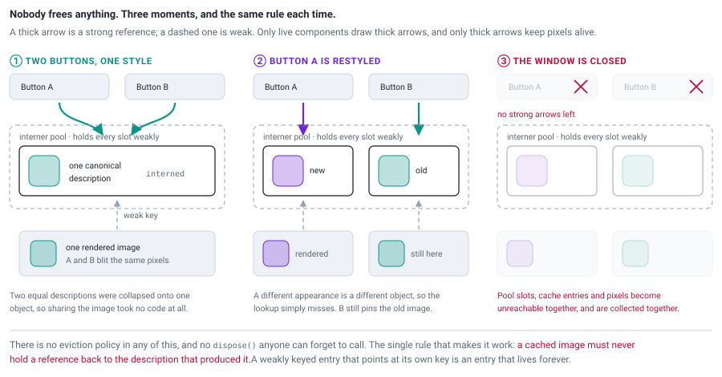

A component paints, interns its description, and holds the canonical instance for as long
as its appearance stays the same. That reference is the entry's only anchor. Restyle the
component and it switches to a different instance, leaving the old one either still pinned
by another component — so the shared image rightly survives — or pinned by nobody, in which
case it drops out of the pool, out of the image cache, and the pixels are collected.
**Cache lifetime is exactly the lifetime of the thing that wants the pixels**, with no
reference counting and no `dispose()` to forget.

Two details matter if you build this yourself. A cached value **must not strongly
reference its own key**, or the map has immortal entries — so cached images know nothing
about the description that produced them. And a weak cache **still needs a ceiling**,
because GC bounds what is *dead* and says nothing about how much *live* material you
accumulate; see [what it costs](#what-it-costs).

Keys stay cheap through two small things: each node of the description tree memoizes its
hash in a single lazily computed `int` (the `String.hashCode()` trick, sound for the same
reason — immutability means a race can only recompute an identical value), and interning
turns deep equality into pointer equality.

---

## When are pixels worth their memory? ##

Caching every layer of every component is wrong, measurably so. Think of an entry as a
bet: the payoff per hit is *(cost to render) − (cost to blit)*, the stake is *bytes held
× how long they are held*, and the odds are the chance the same key is asked for again. A
layer holding one flat rectangle loses on every term at once.

So the engine estimates each term before creating an entry.

- **How expensive is this to draw?** Approximated by counting *heavy ingredients*:
  gradients, sized images, painted text, shadows, procedural noise (counting double,
  being the most expensive thing per pixel), rounded or margined fills, coloured
  borders. A layer with no heavy ingredient is never cached — redrawing it is genuinely
  cheaper.
- **How many pixels?** The score is `pixels ÷ heaviness`, with heaviness capped so an
  ornate style can't buy unlimited size. Above a per-image ceiling the entry is refused;
  far below it, allocated at once, since deliberating costs more than the buffer.
- **Will it be asked for again?** Not answerable statically, so it is *measured*:
  middle-band entries earn their allocation over a number of cache hits, and that number
  rises with the score.

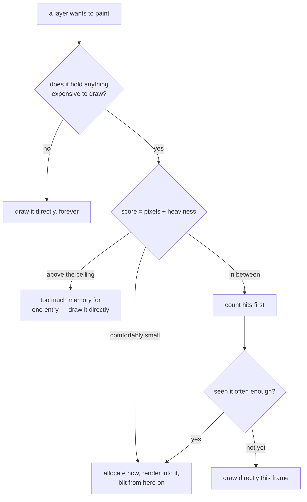

That last branch gets something for free. During a style animation every frame produces a
description seen exactly once, and buffering each would be pure loss — but making entries
earn their allocation filters animations out automatically. No animation detection, no
"is animating" flag to keep correct. **A counter that lets reuse prove itself beats a
predicate that guesses reuse in advance.**

The engine also tracks the size it last painted at, so it knows when a component is
*currently* being resized. While it moves, an entry keyed on the live size is doomed, so
large renderings aren't minted at all and middling ones must survive a repeat first.

None of this changes a pixel. It only changes who pays.

---

## The wall ##

The size is *part of the description*. It has to be, because the rendering genuinely
depends on it. Which means that the moment a user grabs a window edge, every styled
component produces a **new key on every frame**.

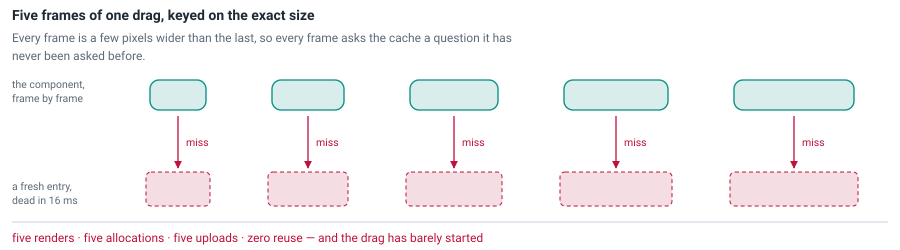

Every frame a miss, every miss a full render, a fresh image discarded 16 milliseconds
later. In the one scenario the cache most exists for, it degrades into pure overhead.

This is the classic failure mode of retained-pixel caching, and it generalizes well past
graphics: **a key that varies with a continuous input is not a key.** You either accept
the miss rate, or you find a *canonicalization* — a function mapping many inputs onto one
representative, such that everything you dropped can be reconstructed from what you kept.

---

## Nine slices to the rescue ##

Ask what actually changes when that rounded, shadowed panel gets wider. The corners:
unchanged, just further apart. The top edge between them: the same band of pixels over a
longer run. The side edges: the same, repeated downwards. The middle: one flat colour,
more of it.

**The panel doesn't get different pixels when it grows. It gets more of the same pixels.**
There are only nine distinct regions, and only five of them stretch.

So for such styles the engine doesn't cache the component's rendering at all. It renders a
**minimal exemplar** instead — the rendering of a hypothetical smallest component at which
every size-dependent pixel still exists, typically a few dozen pixels square — and caches
*that*. At paint time the real size is reassembled with nine blits.

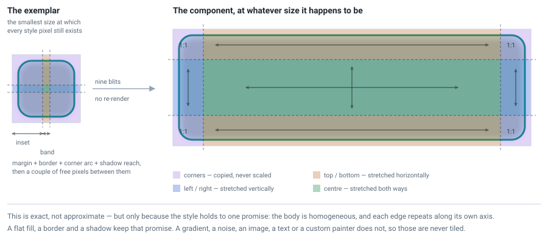

A 3×3 grid with fixed corners and stretchable edges is the technique behind Android's
`.9.png` drawables and CSS `border-image-slice`, which is where the name comes from.

### The exemplar is a description, not a data structure ###

Here is the decision that turns this from a hack into a mechanism. The exemplar is *the
same description value*, with its size field replaced by a smaller size. That one
substitution does two jobs at once:

- it is a **size-independent cache key**, so every size of a given style collapses onto
  one entry;
- and it is an **honest render recipe**: hand it to the renderer and you get exactly what
  a real component of that small size would have produced.

So the renderer is never told that tiling exists. It *cannot* be told, because all it
receives is an ordinary description of an ordinary small component. No tiling mode, no
flag threaded through the drawing code, no second implementation to keep in sync. The
entire feature lives in the choice of key.

That is the part that carries over to other problems: **when you canonicalize a cache key,
try to land on a value that is still a legal input.** Then the producer needs no knowledge
of the canonicalization, and the two can never drift apart. It works here because of one
deliberately maintained invariant: **the size is the only size-dependent property anywhere
in a description.**

### How small is "minimal"? ###

Per side, the size-dependent pixels reach inward by the margin, the outline, the border
width, the larger of the two adjacent corner arcs, and the shadow's reach (blur + spread
+ falloff + offset), plus a couple of pixels of slack for antialiasing bleed. Call that
the **inset**; everything between opposite insets repeats.

You would expect `leftInset + rightInset + a few free pixels`. It is
`2 × max(leftInset, rightInset) + band` — deliberately bigger, and deliberately symmetric.

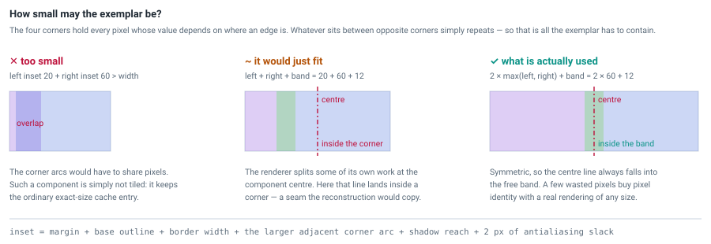

The reason is that parts of the renderer split *their own* work at the component's centre,
where corner shadow clip boxes and border edge polygons meet. If the exemplar's centre
line fell inside a corner, any hairline artifact on that seam would be baked into a corner
and copied verbatim to every size. A symmetric exemplar puts the centre line out in the
free, repeating band, where a seam gets stretched over and vanishes.

### What this buys ###

Same drag as [the wall](#the-wall), same five frames, same style:

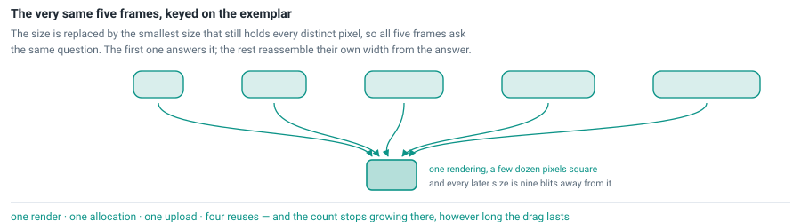

1. **A resize stops being a cache miss.** A component can grow, shrink, be dragged to an
   extreme aspect ratio and back, and the renderer is never invoked again.
2. **Differently sized components share one image.** Twenty buttons at twenty widths need
   one entry. The first to paint fills it.
3. **Size stops gating what can be cached at all.** The per-image ceiling is measured
   against the *exemplar*, so a 3000 × 1500 styled panel costs the same few kilobytes as
   a small one.

Skia and Qt have nine-patch paths of their own (`filterRRectToNine`, `qDrawBorderPixmap`).
What's unusual here isn't the technique, it's that **nobody marks the stretchable
regions**. In Android you paint them by hand into the border pixels of a `.9.png`, whereas
here they are *derived* from the style you declared. You write
`.borderRadius(16).backgroundColor(..).shadowBlurRadius(8)` and resizing becomes free
without any of this ever coming up.

---

## Where reconstruction stops ##

Stretching only gives back the same pixels when the strips we duplicate are all identical.
Plenty of styles fail that, and we turn one more down out of caution:

| Not reconstructed | Why |
|---|---|
| gradients whose colour depends on both x and y: radial, conic, diagonal, rotated, or measured from the centre | no strip repeats in either direction |
| procedural noise | noise varies with every pixel position |
| background images | placement and fit are relative to the component bounds |
| styled text | text is laid out within the component bounds |
| custom painters | the engine cannot know what your painter does |
| components no larger than their own exemplar in either dimension | nothing left to stretch |
| a border colour per edge, with rounded corners and unequal opposite widths | refused conservatively; the pixels would usually survive it |

Anything on that list falls back to an exact-size key: still cached, but re-rendered when
the size changes. Eligibility is decided **per layer**, so a panel with a radial gradient
background and a shadow can reconstruct its shadow while caching its background at full
size.

That last row is a policy rather than a fact about pixels, and it shows the shape of every
eligibility decision here. An over-eager rule wouldn't crash; it would draw subtly wrong
pixels, quietly, forever. A timid one costs a cache miss. So the rules are timid, and
pinned by pixel-equivalence tests that render a style both ways and compare channel by
channel, alpha included.

### Stretching in one dimension only ###

Stretching sideways and stretching downwards need different things. We can stretch a style
sideways when every pixel strip along its y axis is identical, and downwards when every pixel
strip along its x axis is identical. Those two conditions are independent. A style can paint
identical strips along the y axis while every strip along the x axis differs. The case
worth knowing is a linear gradient running straight down a component. We build it from two
points that share an x coordinate, so only a pixel's y position affects its colour. Every pixel
strip along the y axis is therefore identical, and no two strips along the x axis are.

So we compact the exemplar for such a style in width alone: a few pixels wide, but as tall as
the component really is. The cache key carries that real height. Widen the
component and we rebuild the wider rendering from that exemplar by stretching the edge bands,
which costs nothing. Make it taller and the key changes, so we render the style again.

Which gives the rule:

> A component keeps hitting its cache entry as long as it only resizes in the direction its
> gradient does **not** run in.

Note that a *vertical* gradient is what frees the **width**, not the height: identical strips
along the y axis are exactly what lets us throw strips away. A 300 × 500 component whose
exemplar would be 30 × 30 is therefore stored in one of four ways:

| key | shared by components of | style |
|---|---|---|
| 30 × 30 | any size | flat fills, borders, shadows |
| 30 × 500 | any width, if they are 500 tall | a gradient down the component |
| 300 × 30 | any height, if they are 300 wide | a gradient across the component |
| 300 × 500 | this size only | radial gradients, noise, images, text, painters |

Note the catch in the two middle rows: twenty buttons at twenty widths share a single entry
only if they are all the same height. In the first row they would share one whatever their
sizes.

Width and height are judged separately for the component too, not only for the style.
Stretching a dimension needs the component to be larger than the exemplar in it, because a
dimension the exemplar already fills has nothing left to stretch. A bar 400 pixels wide and
20 tall carrying a flat rounded fill repeats in both directions, but only its width has room,
so it is stored under a 26 × 20 key: the exemplar's width, the component's own height.
Toolbars, table rows, progress bars and headers all live in that shape.

A dimension is compacted only if the style repeats along it **and** the component has room in
it. A gradient running across that same 400 × 20 bar repeats downwards, which is the one
direction the bar has no room in, so nothing is compacted and the bar keeps an exact-size key.

### Where real pixels get in the way ###

Two things stand between "nine rectangles" and "nine rectangles that actually look right".

**Fractional HiDPI scaling.** At a scale like 1.5× a tile boundary lands in the *middle* of
a device pixel, so somebody has to round it. The trap isn't the rounding, it's rounding
twice: each of the nine rectangles knows only its own origin and size, and
`round(origin) + round(size)` need not equal `round(origin + size)`. Two neighbours then
disagree about who owns that pixel — one pair leaves it unpainted, another paints it twice.
So the four cut lines per axis are transformed into integer device space *once*, and every
tile takes two adjacent entries out of that one array.

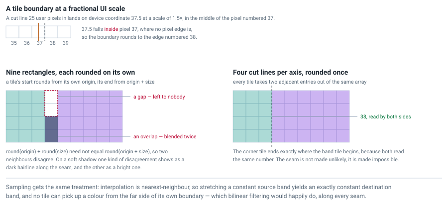

Interpolation is nearest-neighbour for a related reason: stretching a constant band then
yields an exactly constant band, and no tile can sample across its own boundary.

**A driver that lies.** Blitting the stretched tiles straight out of the exemplar with
sub-rectangle `drawImage` calls is pixel-perfect on software surfaces — but not always on
accelerated ones, where a scaled blit from an *interior* sub-rectangle can break down at
large stretch ratios, sampling outside the band or drawing nothing. From the outside that
looks like long component edges mysteriously losing their shadow. Whole-image sources
measure pixel-perfect even at extreme ratios, so each stretchable region gets its own
dedicated image on first use, while the 1:1 corner tiles keep sourcing the exemplar.

Reconstruction also only runs under transforms a tile blit can honour: translation and
positive scaling. Under rotation, shear or a flip the component is rendered directly for
that frame. If you ever suspect an artifact comes from reconstruction, you can take it out
of the picture entirely; see [the safety hatch](#the-safety-hatch).

---

## Partitioning the description ##

A layer's description is not really a *state*. It is a **sequence of drawing operations**
in a fixed order: fills and borders first, then images, gradients, noises, shadows, text,
and last of all any user painters. Treat that sequence as atomic and one uncacheable
element poisons everything — a single custom painter, being arbitrary user code, makes the
whole layer uncacheable, so the shadow and gradient *underneath* it re-render at full size
on every paint. In one measured example that was 39% of a drag frame.

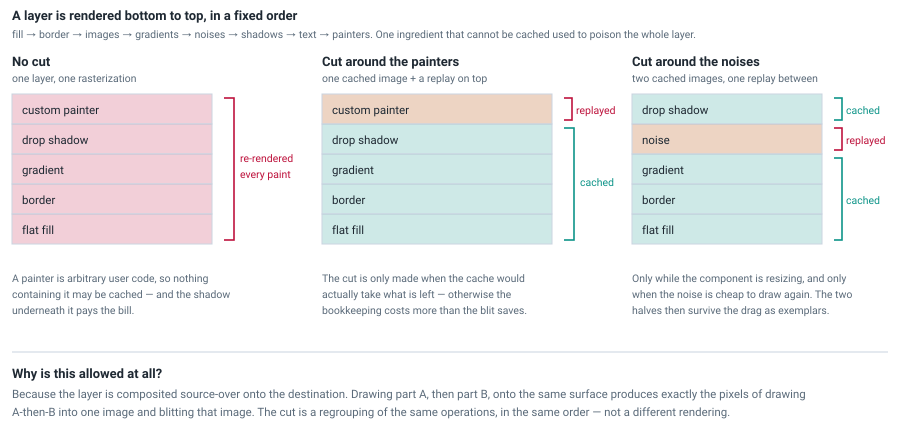

Because the layer is composited **source-over**, drawing piece A and then piece B onto the
same surface produces exactly the pixels of drawing A-then-B into one image and blitting
it. Splitting is a regrouping of the same operations in the same order, not a different
rendering. That is the licence for cutting a description into pieces that individually
make better keys than the whole:

- A piece of arbitrary user code can't be cached, but everything underneath it can be,
  and the uncacheable piece is simply replayed on top.
- A piece whose pixels depend on the full bounds (procedural noise being the classic case)
  blocks reconstruction for the whole layer. Lift it out and the pieces around it become
  reconstructable again — a trade that only pays when redrawing the lifted piece is cheap,
  which for noise it is, for [reasons below](#the-caches-underneath).

Two rules govern whether a split happens at all, and both generalize.

**A split must pay for itself.** It adds bookkeeping, a second lookup and a second blit.
Splitting unconditionally comes out about 7% *slower* on a styled view whose
painter-bearing layers hold nothing heavier than a flat fill. So the decision is made by
asking the admission policy whether the remaining piece is worth an entry.

**A key must describe pixels and nothing else.** The piece you keep is normalized so that
it carries no trace of the piece you removed, not even its *name*. Names are metadata for
the author, not input to the rasterizer; let one leak into a key and two components whose
cached halves are byte-for-byte identical mint an image each because they called their
painters `"mark"` and `"logo"`. Since entry counts are capped, that debris then locks
*other* components out of caching.

### Opting a painter into the cache ###

A painter is uncacheable by default because a lambda is opaque. If your painting is a pure
function of an immutable value with proper `equals`/`hashCode`, you can say so, and that
value becomes part of the key:

```java
.withStyle( it -> it
    .painter(UI.Layer.CONTENT, Painter.of(myImmutableModel, g -> { /* draw */ }))
)
```

One ordering rule comes with it. Painters on a layer are painted in **name order**, and
only the longest *prefix* of cacheable ones is baked into the image — so a cacheable
painter sitting above an uncacheable one is replayed every paint along with it, even
though the engine could have cached it in isolation.

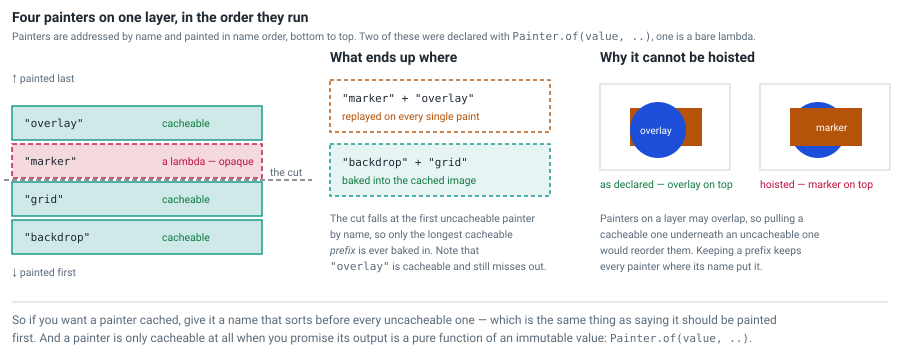

That looks like a missed opportunity until you try to take it: painters may overlap, so
baking that one into the image would slide it *underneath* the uncacheable painter it was
declared above, and change the picture. Keeping a prefix keeps every painter where its
name put it. If you want such a painter cached, name it to sort before every uncacheable
one — which is the same thing as saying it should be painted first.

---

## The caches underneath ##

The layer cache is the headline. Underneath it sit four smaller ones, and they matter for a
reason that isn't obvious: they keep the *uncached* path from being a cliff. Partitioning a
layer, refusing an entry, falling back to a direct render — each of those is only affordable
because the work it falls back on has already been thinned out. And each of the four is a
move you have seen already.

**Noise, keyed where it is defined.** Java2D rasterizes a `Paint` in fixed 32 × 32 chunks,
so filling a window-sized background through the paint pipeline becomes thousands of tiny
composites, each running the noise function per pixel. Large areas therefore skip that
pipeline: the noise is pre-rendered into 256 × 256 tiles and blitted. The good part is
*where the tile grid is anchored* — not in the component, but in **noise space**, the
coordinate system the noise function is defined in.

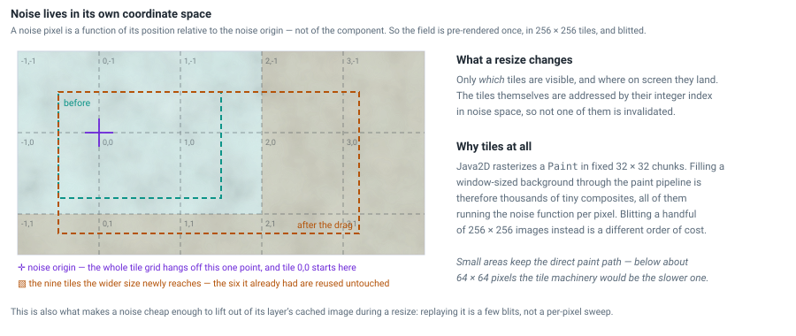

A tile's contents then depend only on its integer index. Resize the component, scroll it,
animate its offset: *which* tiles are visible changes, and where they land changes, and not
one of them is invalidated. That is nine-slicing wearing a different hat — **express the
key in the space where the thing is defined, not the space where it happens to be
displayed.** (Below roughly 64 × 64 pixels the direct paint path is faster, so small areas
keep it. The same predicate decides that and whether a noise is cheap enough to lift out of
a cached layer, so the two can never disagree.)

**Shadows, split where geometry stops mattering.** A soft shadow's falloff is a gradient
with dozens of blended colour stops, and those blended colours depend only on the shadow's
colour, its inset/outset direction and its falloff curve. Geometry decides only *where the
stops sit*, which is float arithmetic.

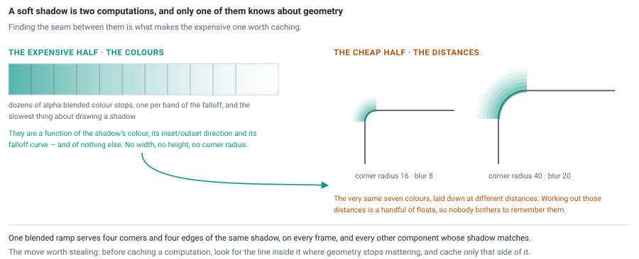

Split the computation along that seam and the expensive half is computed once and reused
across all four corners, all four edges, every frame, and every component with a matching
shadow. Finding the line between the geometry-dependent and geometry-independent halves of
a computation often pays better than optimizing either half.

**Text, lent out exclusively.** Line-breaking a wrapped paragraph is expensive, so the
layout state is cached — except that it holds a `LineBreakMeasurer`, which carries a
traversal position. That's a cursor, not a value. So instead of guarding re-entrancy with a
flag, an entry is *removed* from the map while it is in use and put back afterwards; a
re-entrant layout of the same paragraph simply misses and builds its own. If a cached object
is stateful, hand it out exclusively and let the miss path be the safety net.

**Geometry, riding along for free.** The body, interior, border, exterior and content
shapes — plus the per-edge border regions, which need genuinely expensive boolean `Area`
intersections — are a pure function of the box geometry alone. They are keyed on the same
interned geometry value from earlier, so components with matching boxes share them even
when nothing else about their styles matches, and they inherit the self-clearing lifetime
without asking for it. That is interning compounding: once you have canonical instances,
*every* derived computation gets a correctly scoped cache for nothing.

---

## Not caching: doing less work ##

Performance work has two halves. One is remembering results. The other is noticing that
the work was never necessary — and unlike a cache, that half pays on every frame, hit or
miss.

### Antialias only what is actually curved ###

Back to step 2 of a frame: the coverage mask. Antialiasing isn't a per-pixel cost, it's a
*whole shape* cost, because it forces a software rasterization pass before anything is
composited, even onto a GPU surface. For a layer covering a maximized window, that is
millions of mask pixels per fill, per frame — and nearly all of them come out fully opaque.
Which is a lot of arithmetic to establish that the middle of a rectangle is inside the
rectangle.

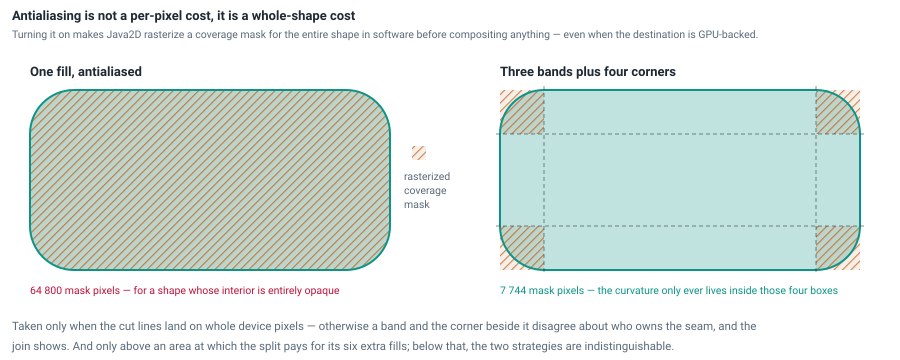

So an integer-valued rectangle is filled with antialiasing off, after a check that the
transform doesn't land its edges between pixels. And a rounded rectangle curves only inside
its four corner boxes, so it is filled as three antialiasing-free bands plus four
antialiased corners — each corner being the whole shape clipped to its own box, so the
curve is rasterized by exactly the code that would have drawn it anyway.

Both are hedged, and the hedges are the interesting part. The cut lines must land on whole
device pixels, or a band and the corner beside it disagree about who owns the seam and the
join shows. And there must be enough area to repay six extra fill calls — a threshold taken
from a [dedicated benchmark](../../src/test/java/benchmarks/RoundedGradientBenchmark.java)
and set above the noise floor rather than at the apparent crossover. Above a UI scale of
2.25 the engine stops forcing antialiasing at all, because at that density the smoothing
isn't buying anything a human can see.

### Staying on the fast paths the JDK already has ###

The JDK has fast paths for the two things a UI does constantly: drawing text and repainting
a region. Both are easy to step off by accident, and neither failure announces itself.

**Text.** You *can* put a colour into a `Font` as a `TextAttribute.FOREGROUND`. Doing so
flips `Font.hasLayoutAttributes()`, after which every `stringWidth` and every `drawString`
of that font is routed through a freshly built `TextLayout` instead of the glyph cache. So
the style engine never does it: a solid font colour travels through the component's
**foreground** property, and only the geometric parts of a font — family, size, weight,
posture, spacing — go into the `Font` itself. Genuinely layout-hungry text (gradient
painted, letter spaced, underlined) still takes the slow route, but that is a decorative
accent in real UIs, not the bulk.

**Repaints.** An opaque component promises to cover its bounds, which lets the repaint
manager stop walking up through its ancestors. Give that up and every repaint costs more.
But an opaque component's UI delegate also fills its whole bounds with `getBackground()`
first, which would erase the gradient, shadow or image the style engine just drew
underneath. So the flag is kept **true** and the component's AWT background is set to a
fully transparent colour: the Look-and-Feel dutifully fills the bounds with nothing at all,
the repaint manager keeps its optimization, and the style painting survives. *(Which is why
you should never call `setOpaque(..)` yourself on a styled component — the engine owns that
flag and will fight you for it.)*

---

## What it costs ##

All of this is bounded by one budget, derived the way real systems size memory pools
(database buffer caches, JVM heap ergonomics): a **fraction of physical RAM, clamped
between a floor and a cap**.

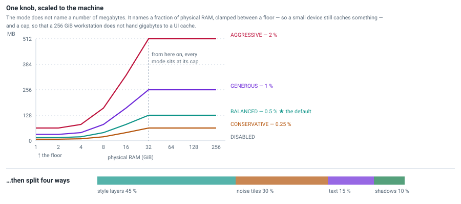

The floor guarantees a small but useful cache on a 1 GiB device, where a proportional
curve alone would collapse to zero and turn caching silently off. The cap, rather than a
slow logarithm, is what delivers diminishing returns:

| Mode | Share of RAM | Floor | Cap |
|---|---|---|---|
| `DISABLED` | 0% | — | 0 MB |
| `CONSERVATIVE` | 0.25% | 8 MB | 64 MB |
| `BALANCED` ⭐ | 0.5% | 16 MB | 128 MB — *a light browser tab* |
| `GENEROUS` | 1% | 32 MB | 256 MB — *a heavy browser tab* |
| `AGGRESSIVE` | 2% | 64 MB | 512 MB — *a heavy Electron app* |

In absolute terms at `BALANCED`: ~20 MB on a 4 GB machine, ~41 MB on 8 GB, ~82 MB on
16 GB, and the 128 MB cap from 32 GB up.

That total is then split across the caches — 45% to style layers, 30% to noise tiles, 15%
to text layouts, 10% to shadow gradients — and each slice is expressed two ways: a **byte
ceiling** governing retention, and a pixel-area figure governing **admission**, since "is
this single image too big?" is naturally a question about pixels. Bigger machines therefore
admit bigger images, not merely more of them.

One thing to be clear about: **these are ceilings on retention, not pre-allocations.** A
cache only ever holds what your components actually produce, so a small app on a big
machine costs very little even though its ceiling is high. Lowering the mode at runtime
frees the excess immediately.

---

## What measurement says ##

### Most of the frame isn't the style engine's to spend ###

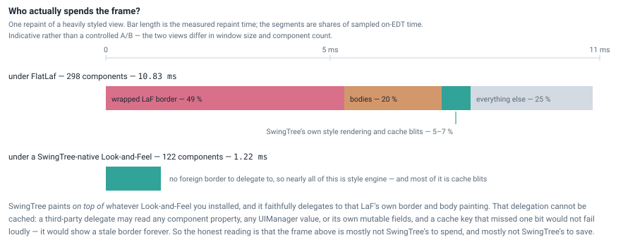

In a 298-component styled view under a third-party Look-and-Feel, the single largest cost
in the frame (49% of it) is that Look-and-Feel rasterizing a rounded outline for the border
and the focus ring, twice per component, and uploading the coverage masks. Another ~20% is
the component bodies. **The style engine's own rendering and cache blits together are
5–7%.**

That is not a boast, it's a limit. SwingTree wraps a component's original border and
faithfully delegates to it when your style doesn't define a visible one, and that
delegation **cannot** be cached — not "isn't yet". A cache key has to enumerate every input
its output depends on, and a third-party border or UI delegate may read any component
property, any `UIManager` value, or its own mutable fields. A fingerprint that misses one
bit doesn't fail loudly; it renders a stale border indefinitely.

**You can only cache what you can key, and you can only key what you can enumerate.** That
is the boundary of this whole approach, and it falls right where a third-party rendering
contract begins. The numbers point the same way: a Look-and-Feel built *on* the style
engine paints a comparable spread of component families (text fields, combo boxes, sliders,
tabs, scroll bars) in **1.22 ms** against the other view's 10.83 ms. Not a controlled A/B —
that view has 122 components to the other's 298 at a smaller window size — but the gap is
far wider than those ratios explain.

### Hit rates are eligibility-bound, not budget-bound ###

Summed over whole component trees and whole runs:

| view | background layer | content | border |
|---|---|---|---|
| neumorphic surfaces (flat fills + soft shadows) | **99.6%** | 99.5% | – |
| a SwingTree-native Look-and-Feel | 56.3% | 99.7% | 99.9% |
| cards with SVG images and shadows | 46.3% | 94.0% | 99.7% |
| a 298-component style studio | 29.2% | 99.5% | 99.7% |
| four large radial gradients | **17.5%** | 37.0% | 38.2% |

The spread between top and bottom is almost entirely about whether the style clears the
reconstruction bar. Running the same corpus at `AGGRESSIVE` — four times the budget, four
times the per-image ceiling — moves the studio from 29.2% to 29.2%, which is not a typo,
and the SVG cards from 46.3% to 46.5%.

That rules out a whole category of proposal. The misses are not misses for lack of room;
those layers are **not admissible, or not size-independently keyable**. Any idea that
amounts to "cache more" has to get past that number first.

---

## Using it ##

### The default ###

Do nothing. `BALANCED` is on, reconstruction is on, every cache in this article is working.

### Choosing a mode ###

```java
import swingtree.SwingTree;
import swingtree.SwingTreeInitConfig.CacheMode;

// at startup:
SwingTree.initializeUsing( cfg -> cfg.withCacheMode(CacheMode.GENEROUS) );

// at runtime — takes effect on the next paint; lowering it frees memory at once:
SwingTree.get().setCacheMode(CacheMode.CONSERVATIVE);
CacheMode current = SwingTree.get().getCacheMode();
```

Or without touching code:

```
-Dswingtree.cacheMode=AGGRESSIVE
```

- **Just shipping an app?** Leave it on `BALANCED`.
- **Memory-constrained target** (kiosk, embedded, tablet, many app instances at once)?
  Drop to `CONSERVATIVE`, or `DISABLED` if RAM is truly scarce.
- **Lots of style animation, frosted-glass filters, big resizable windows, long styled
  lists?** Move up to `GENEROUS`, or `AGGRESSIVE` on a workstation.
- **Chasing a rendering bug?** Set `DISABLED` temporarily. Caching only ever makes
  rendering do *more* work, never *different* work, so the direct-render path should look
  identical.

You can also adapt at runtime, starting at `GENEROUS` and dropping to `CONSERVATIVE` when
the OS signals memory pressure.

### The safety hatch ###

Nine-slice reconstruction *rebuilds* pixels rather than re-rendering them, so it has its
own separate off switch:

```java
SwingTree.initializeUsing( cfg -> cfg.withCacheTilingEnabled(false) ); // at startup
SwingTree.get().setCacheTilingEnabled(false);                          // at runtime
```

```
-Dswingtree.cacheMode.tiling=false
```

Switching it off does not disable caching; it restores exact-size cache keys, so styles are
still cached, they just re-render when the size changes. If a suspicious artifact survives
with it off, the reconstruction isn't the culprit.

### Watch it work ###

Press **`Ctrl + Shift + I`** over a running SwingTree window (the shortcut is configurable,
and `SwingTree.get().setDevToolEnabled(true)` also enables the tools). At the top of the
dev-tool window is a collapsed **SwingTree Library Settings** panel; drag the divider down.
It has a live **Cache mode** selector, a **9 patch tiling** checkbox, and a live readout of
entry counts for every global rendering cache.

Set the mode to `DISABLED` and watch the counts fall to zero. Untick *9 patch tiling* and
watch a resize start re-rendering. It is by far the fastest way to build intuition for any
of this.

### Ask a component about itself ###

For tests and tooling, every styled component can report on its own caching:

```java
ComponentExtension<?> ext = ComponentExtension.from(myComponent);

Tuple<BufferedImage> images = ext.cachedRendering(UI.Layer.BACKGROUND);
int hits   = ext.cacheHitCount(UI.Layer.BACKGROUND);
int misses = ext.cacheMissCount(UI.Layer.BACKGROUND);
```

The image dimensions tell you how the style was cached. A dimension much smaller than the
component's is one we compacted, a dimension matching the component's is one we did not, so an
image smaller in both is a fully compacted exemplar and one matching in both is an exact-size
entry. More than one image means we split the layer's description. The returned images are
defensive copies, so you can inspect or even modify them freely.

### Styling for speed ###

If you want a resize to be free, keep the style's *edges* size-independent:

- ✅ flat background and foundation colours, borders, shadows — reconstructable, including
  a border with its own colour on each edge
- ✅ a linear gradient running straight up, down or across — free in one direction only: a
  panel with a vertical gloss resizes sideways for nothing, and re-renders when its height
  changes
- ⚠️ radial, conic, diagonal and rotated gradients, noises, background images, styled text —
  cached, but at an exact size, so a resize re-renders them
- ⚠️ rounded corners plus a colour per border edge, with two **opposite** edges of unequal
  thickness — the one non-obvious disqualifier, and a deliberately strict one: 4 px against
  5 px already drops the layer back to exact-size caching. Give opposite edges the same
  width (the adjacent ones may differ freely) and it qualifies
- 💡 a custom painter doesn't block its whole layer from being cached, but it does run every
  paint unless you wrap it in `Painter.of(immutableValue, ..)`
- 💡 a heavily styled component is admitted more readily than a lightly styled one, which is
  the right way round

And the caveat from the measurements: in a component-dense UI under a third-party
Look-and-Feel, most of the frame belongs to that Look-and-Feel. If you are chasing the last
milliseconds there, the lever is the Look-and-Feel itself, which is one of the reasons
[building one on the style engine](./Building-A-Look-And-Feel.md) is worth a look.

---

## What to take away ##

Strip out the Swing and most of this is a set of moves for any layer that retains derived
results:

- **Make the key an immutable description of the output.** Then invalidation isn't a thing
  you can forget, because it isn't a thing you do.
- **Intern the keys weakly and key the cache on the canonical instances.** Sharing and
  correct lifetime come for free, with no eviction policy, as long as no value strongly
  references its own key.
- **Treat an entry as a bet, not a right.** Cap what one entry may take, and let reuse
  prove itself with a counter rather than guessing it with a predicate.
- **When a key varies continuously, canonicalize onto a value that is still a legal
  input**, so the producer never has to know the canonicalization exists.
- **Key things in the space where they are defined**, not where they are displayed.
- **Partition a description where composition guarantees the pieces add up**, and let
  nothing into a key that cannot change a pixel — not even a name.
- **Be timid wherever the failure mode is silently wrong output**, and pin those rules with
  equivalence tests rather than benchmarks.
- **You can only cache what you can key, and you can only key what you can enumerate.**
  Where that runs out, at a foreign rendering contract for instance, the honest answer is
  to stop, and say so.
